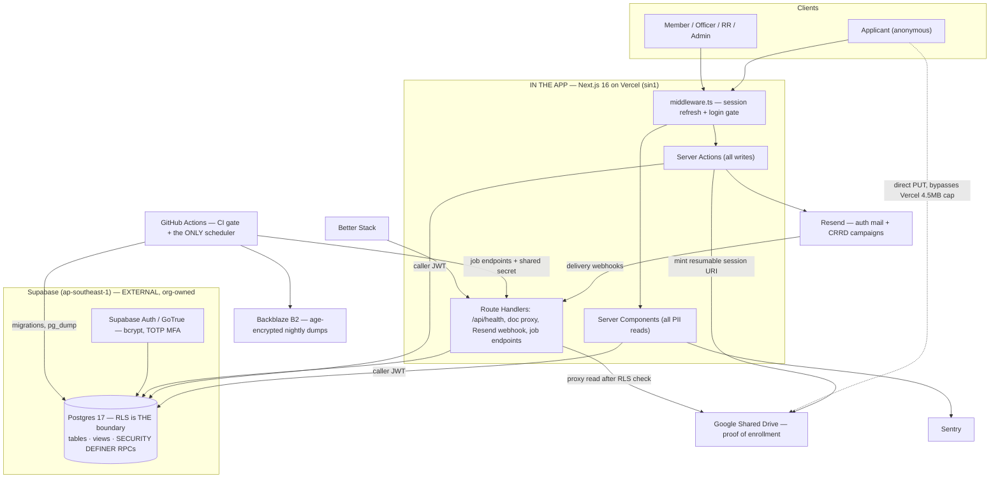

# ARCHITECTURE — START-SYS

Centralized Membership Information Management System for START-DOST.
Scope authority: [`PRD.md`](./PRD.md). Schema authority: [`DATA_MODEL.md`](./DATA_MODEL.md) (28 tables — deliberately not duplicated here).
**Org-structure authority: the START-DOST Constitution and By-Laws, 2026 edition (CBL)** — positions, tenure, separation from office and termination of membership are cited inline as `CBL Art. N §M`. This is not a courtesy: the PRD's own assumption is that *"the system will follow the CBL in terms of member status and organizational structure."* Where this file previously extrapolated org structure from the PRD, the Constitution now supplies it.
This file is the **stack + boundaries + flows** authority. If another doc disagrees with this file on a technology choice, this file wins.

---

## TL;DR

- **One Next.js 16 app on Vercel, one Postgres 17 on Supabase, no ORM, no queue, no Docker.** All data access goes through `supabase-js` carrying the caller's JWT, so Postgres Row Level Security applies to every query by construction. There is no second connection path that could skip it.
- **Authorization lives in the database, not the app.** RLS + column-level GRANTs are the enforcement boundary; middleware and Server Action guards are UX and defence-in-depth. If middleware were deleted tomorrow, no PII would leak. Roles are read live from a `user_roles` table (never stamped into the JWT), so graduation/resignation revokes access instantly.
- **Term archival is a status flip, not a data migration.** One `terms` row is `active` (enforced by a unique partial index); `current_term_id()` filters every dashboard. Rollover is one transactional function. Nothing is ever moved, and **no `DELETE` policy exists anywhere in the schema**.
- **Member IDs (`2024-001`) live on `people`, not on `memberships`** — renewal inserts a membership row and never touches the number, so `2024-001` structurally cannot become `2025-001`. Allocation is a single-statement counter-table upsert, safe under concurrent approvals.
- **The Constitution is data, not code.** The 23 CBL positions (Art. III §2, §3, §4.6, §5) and the seven departments (Art. III §4) are seeded rows; committees are rows created at runtime (Art. III §5) — **adding, restructuring or dissolving a committee needs no migration, no deploy and no code change**, which is §4.4. Nothing about the org chart is hard-coded in TypeScript, so an Art. XII amendment is a cited migration rather than a rewrite.
- **Proof-of-enrollment files never touch our servers or our database.** The browser PUTs directly to a Google Shared Drive via a server-minted resumable session URI (Vercel caps request bodies at 4.5MB; phone photos exceed it). Viewing goes through a proxy route that re-uses the same RLS check.

---

## 1. Locked stack

Every version below is **locked**. Do not substitute. Deviations require an ADR at `docs/decisions/NNNN-slug.md` (CONVENTIONS.md §9 D3) and an update to this table. `SCRATCH.md` is a disposable LLM scratchpad, never a decision record.

**Pinning rule:** every npm dependency is written to `package.json` as an **exact version, no caret** (`pnpm add --save-exact`), and the lockfile is committed. Rows below that read "latest stable" mean *pin whatever is stable on the day you install it, then leave it alone* — they are not floating ranges.

### Runtime & language

| Item | Version pin | Role | Why this and not the alternative |
|---|---|---|---|
| Node.js | `24.x` LTS, exact patch in `.nvmrc` + `engines`; Vercel project set to Node 24 | Runtime: local, CI, prod functions | Active LTS through Apr 2028 — outlives two officer handovers. `nvm use` gives a 2029 maintainer the right runtime with zero instructions. |
| pnpm | `11.x`, exact version in `packageManager` field, Corepack-pinned | Package manager | Lockfile committed; CI runs `pnpm i --frozen-lockfile`. A handover that produces a different `node_modules` produces different bugs. |
| TypeScript | `5.9.3` exactly. `strict: true`, `noUncheckedIndexedAccess: true` | Language | **Deliberately not TS 6 or 7.** TS 7's native compiler is not yet lintable by typescript-eslint and sits behind an experimental flag in Next 16.3. For rotating student maintainers the linter is worth more than compile speed. Upgrade trigger: Next defaults to TS 7 **and** typescript-eslint's peer range accepts it. |

### Application

| Item | Version pin | Role | Why |
|---|---|---|---|
| Next.js | `16.3.x`, App Router | Pages, Server Components, Server Actions, Route Handlers — the whole app | One repo, one language, one deploy. No separate API service and no API contract to keep in sync across a leadership transition. All PII is read in Server Components so it never enters a client bundle. Most heavily documented web framework in existence, which matters when every future maintainer pairs with Claude Code. |
| React / React DOM | `19.2.x` (whatever Next 16.3.x's peer range resolves to) | UI runtime | Required peer. **Not independently chosen and not independently upgraded** — it moves when Next moves. |
| Tailwind CSS | `4.3.x`, CSS-first config (`@theme` in `globals.css`) | Styling | No `tailwind.config.js` archaeology for the next officer. |
| shadcn/ui | CLI-installed, components **vendored** into `components/ui/` — **not a runtime dependency** | Dialogs, tables, forms | The component source is code the org owns outright. No breaking major version can land on a team with nobody available to handle it; next year's officers can edit a button without learning a library API. |
| @tanstack/react-table | `8.x` | Member / application / officer grids | Sorting, faceted filtering, pagination — the Search & Filtering FR — from one library, backed by pg_trgm GIN indexes. |
| lucide-react | latest stable at install, pinned exact (no caret) | Icons | What shadcn expects. Not an independent decision. |
| zod | `4.x` | Validation schemas, one per entity/form | The *same* schema is imported by the client form and re-run inside the Server Action. The Data Integrity NFR implemented once instead of twice and drifting. |
| react-hook-form + @hookform/resolvers | `7.x` + `5.x` | Form state | Wired to the same zod schemas. The membership application is long and multi-section; hand-rolling its state is where a week disappears. |

### Data

| Item | Version pin | Role | Why |
|---|---|---|---|
| PostgreSQL | `17`, Supabase-managed, **Pro plan**, `ap-southeast-1` (Singapore) | Database **and authorization engine** | Singapore is nearest to PH (~40ms RTT) and a defensible cross-border transfer location for the RA 10173 processing register. **Pro is required at launch, not later:** Free auto-pauses after 7 days idle (this system is idle for months between application periods) and has no automated backups — that is the Availability NFR and the Backup & Recovery NFR failed on day one. |
| @supabase/supabase-js | `2.112.x` | **The only data-access path for user-facing code** | Every query carries the caller's JWT through PostgREST, so RLS applies by construction and cannot be forgotten. There is no second connection path, therefore no way to write a query that skips the security boundary. **The single decision the whole security model rests on.** |
| @supabase/ssr | `0.12.x` | Cookie-based sessions in App Router + middleware | Server Components, Server Actions and middleware share one authenticated client, so there is exactly one notion of "who is calling". |
| supabase CLI | `2.116.x`, devDependency | Migrations + type generation | Plain `.sql` in `supabase/migrations/`, committed, applied by CI on merge. **Schema is never clicked into the dashboard** — dashboard drift is how a student project permanently loses its schema history. `supabase gen types typescript` → `database.types.ts`, committed and verified in CI. |
| pgTAP | latest stable, enabled via migration | RLS security test suite, **CI-blocking** | The most important artifact in the repo. See §5. |
| **NO ORM** | — | Absent by design | Prisma and Drizzle both connect through the pooler as a privileged role and **bypass RLS** unless every call remembers to set the session role. One forgotten call silently returns all 600 scholars' PII — no error, no crash, no log entry. Cost accepted: complex reporting lives in SQL views and RPCs, not a query builder. |

### Integrations

| Item | Version pin | Role | Why |
|---|---|---|---|
| **Outbound mail — interim (ADR 0010, 2026-09-06):** `lib/mail/` transport interface; `MAIL_TRANSPORT=gmail_smtp` sends from the org's `@gmail.com` account over SMTP with an App Password via `nodemailer` `9.1.1` until the org owns a domain (OQ-10) and Resend can be verified. ~500/day, no bounce webhooks, spam risk on bulk — all documented in the ADR. The row below is the launch target, unchanged. | — | — | — |
| Resend | `6.x` | **All** outbound email: Supabase Auth custom SMTP **and** CRRD bulk campaigns | One vendor, one API key, one set of DNS records. Also the custom SMTP for Supabase Auth, because the built-in mailer is rate-limited to a couple of messages/hour and is unusable in production. Batch send at 100/call; delivery webhooks give CRRD a real per-recipient report. |
| react-email + @react-email/components | `6.x` + `1.x` (devDep for the preview server) | HTML email templates | Renders to table-based HTML that survives Gmail and Outlook — the PRD's "emails with an HTML format attached". `react-email dev` gives a non-technical DCCDO a live browser preview before a 600-person send. |
| googleapis | **pin exactly whatever is installed** (this package versions very fast — do not chase it) | Google Drive v3 client | Official client. Scoped to `drive.file` **only**. |
| @sentry/nextjs | `10.x`, free tier | Error tracking | PII scrubbing via `beforeSend` stripping request bodies. Without it, a failure in the Drive upload or the campaign drain is invisible until an applicant complains. |

### Ops, CI, infra

| Item | Version pin | Role | Why |
|---|---|---|---|
| Vercel | Hobby plan, functions pinned to `sin1` | Hosting, git-push-to-deploy | Deploy = merge to main; rollback is a button; no SSH/TLS/nginx/systemd/Docker in the handover surface. `sin1` co-locates with the DB — the default US region adds ~220ms per round trip from Manila and a dashboard makes several. **Org-owned account, never a student's personal one.** |
| GitHub Actions | `ci.yml` + `scheduled.yml` — two files, no more | CI gate **and the single scheduler for every recurring job** | One syntax, one log viewer, one place for a 2029 maintainer to look. See §8. |
| Backblaze B2 | free tier (10 GB) | Off-provider encrypted backups | Survives losing the Supabase account entirely — a genuine student-org failure mode at handover. **Deliberately not the org's Google Drive**, so one lost Google account does not take both the documents and the backups. |
| age | latest stable, CI only | Backup encryption | Public key committed to the repo; private key held offline by the CTO and escrowed with the faculty adviser. An unencrypted dump of 600 scholars' PII in object storage *is itself* the breach. |
| Better Stack | free tier | Uptime monitoring + alerting | Pings `/api/health` every 3 min from two regions; that endpoint runs a real `SELECT 1`, not a bare 200. Alerts to CTO phone + Discord webhook. Turns the 99.9% NFR into a number someone reports. |
| Google Cloud project + service account + **Google Shared Drive** | Drive API v3, scope `drive.file` only | Proof-of-enrollment storage | Shared Drive (not anyone's My Drive) so files are owned by the drive and survive key rotation and graduation. See §4.1 and `openQuestions`. |
| Bitwarden | Teams tier (~5 admin seats) | Credential vault | Holds Vercel, Supabase, Resend, GCP, Cloudflare and the backup decryption key. Rotating all six is a mandatory line on the handover checklist. The alternative — credentials in a graduating senior's personal password manager — is the exact failure the PRD's problem statement is about. |
| Cloudflare Registrar + DNS | ~$15/yr at cost | Domain + DNS | Required for Resend DKIM/SPF/DMARC, and so the app is not on a `*.vercel.app` URL that reads as a phishing page to a scholar being asked to upload their Certificate of Registration. |

### Testing & quality

| Item | Version pin | Role | Why |
|---|---|---|---|
| Vitest | `4.x` | Unit tests | Three suites that matter: the member-ID allocator under concurrency, the audience-filter compiler, the term-rollover function. **Not a coverage target** — these are the three places where a wrong answer is expensive and a test is cheap. |
| @playwright/test | `1.6x.x` | E2E smoke, **CI-blocking** | Six flows: login; applicant submits with file upload; admin approves and a member ID appears; campaign send; term rollover; regional-rep scope-leak check. |
| ESLint + Prettier | eslint `9.x` flat config + prettier `3.x`, one `pnpm check` | Lint + format | Carries the load-bearing rule: `no-restricted-imports` confining the service-role client to `lib/server/admin-client.ts`, so the "just use the service key" shortcut cannot be taken silently — it requires editing a lint rule, which shows up in a diff. |

---

## 2. System boundaries



| Boundary | What is ours | What is theirs | Blast radius if it fails |
|---|---|---|---|
| **Vercel** | The entire app; stock Next.js, nothing Vercel-specific | Hosting, CDN, function execution | Site down. Escape hatch: `next build && next start` on a $5/mo VPS is a same-day migration. |
| **Supabase** | Schema, RLS policies, RPCs, views, migrations (all in git) | Postgres hosting, Auth/GoTrue, PostgREST, daily backups | Total outage. Postgres is *plain* Postgres — the DB can move to Neon or self-hosted without touching application code. |
| **Google Drive** | Upload orchestration + the proxy read route; everything behind `lib/documents/` | File bytes, storage quota | New applications cannot attach proof; existing records keep their `web_view_link`. Fallback is a ~150-line change behind the interface. |
| **Resend** | Templates, audience resolution, the queue (which is DB rows) | SMTP delivery, bounce/complaint webhooks | Campaigns stall in `queued`; the 15-min sweep resumes them when Resend returns. Auth invites and password resets stop. |
| **GitHub Actions** | Both workflow files | Runner minutes, cron trigger | No backups, no campaign sweep, no PII purge until fixed. Nothing user-facing breaks. |

**Not in the system, per PRD §VI:** operations management, event management, financial management, general file storage, advanced analytics. Other than the public `/apply` form, the system is not accessible to the general public.

**Also not in the system, although the Constitution describes them.** Meetings and quorum (CBL Art. IX), the General Assembly (Art. XI), amendments (Art. XII), the committee-approval chain of Art. III §5.1–5.2 (co-endorsement → COO review → CEO approval), program accreditation (Art. VII §2), and every notice period in Art. VI and Art. VII — the 5-day LOA notice, the 10-day resignation notice, the 5-day AWOL reply window, the 2-week impeachment ruling deadline, the 10-day window to fill a vacancy. **The system records outcomes and stamps who and when; it does not run the proceedings.** Those are deliberations between humans, and the audit log answers *"was this done on time?"* after the fact. Building the workflow would be a second application inside this one — see DATA_MODEL.md §3.4 for the additive tables that would carry it if it is ever wanted.

---

## 3. Directory structure

```
start-sys/
├── PRD.md  ARCHITECTURE.md  DATA_MODEL.md  CONVENTIONS.md  CLAUDE.md  SCRATCH.md
│                               # TEST_STRATEGY.md / SPEC.md / API_CONTRACTS.md / SKILLS.md are
│                               # deliberately absent — the build framework's decision tree adds a
│                               # doc when the pain appears, not speculatively. Test rules currently
│                               # live in CONVENTIONS.md §8.
├── docs/
│   ├── RUNBOOK.md              # index of the five numbered runbooks
│   ├── decisions/              # ADRs — NNNN-slug.md, the only place a locked-stack deviation is recorded
│   ├── issues/                 # incident + issue log, YYYY-MM-DD-slug.md
│   ├── runbooks/
│   │   ├── 01-TERM_ROLLOVER.md
│   │   ├── 02-RESTORE_FROM_BACKUP.md      # drilled quarterly, result recorded here
│   │   ├── 03-CREDENTIAL_ROTATION.md
│   │   ├── 04-MFA_RECOVERY.md
│   │   └── 05-INCIDENT_RESPONSE.md        # incl. pre-drafted 72h NPC breach notice
│   ├── ANNUAL_HANDOVER.md      # the outgoing CTO signs this
│   └── privacy/                # RA 10173: processing register, DPAs, privacy notice
├── .github/workflows/
│   ├── ci.yml                  # blocks merge
│   └── scheduled.yml           # THE ONLY SCHEDULER — every recurring job
├── supabase/
│   ├── migrations/*.sql        # source of truth for schema; never the dashboard
│   ├── seed.sql                # 18 PH regions (incl. Negros Island Region) + island groups; the 23
│   │                           # CBL officer_positions (Art. III §2/§3/§4.6/§5) and the seven
│   │                           # departments (Art. III §4). Committees are NOT seeded — §4.4.
│   └── tests/                  # pgTAP: rls_*.sql, meta_force_rls.sql, member_id_concurrency.sql
├── app/
│   ├── (public)/apply/         # anonymous; the only unauthenticated write path
│   ├── (auth)/login  /auth/reset  /auth/mfa/
│   ├── (member)/portal/        # forms only
│   ├── (officer)/directory/    # v_member_directory, read-only
│   ├── (rr)/region/            # scoped to auth_region_id()
│   ├── (admin)/
│   │   ├── dashboard/  members/  applications/  committees/
│   │   ├── departments/  officers/  campaigns/  audit/
│   │   └── system/             # tech_admin only: terms, windows, user_roles
│   └── api/
│       ├── health/  health/drive/
│       ├── applications/[id]/proof/route.ts   # the RLS-reusing document proxy
│       ├── webhooks/resend/
│       └── jobs/{purge,campaign-sweep}/       # JOB_SHARED_SECRET
├── components/ui/              # vendored shadcn — org-owned source
├── emails/                     # react-email templates + previews
├── lib/
│   ├── supabase/               # server.ts, client.ts, middleware.ts
│   ├── server/admin-client.ts  # the ONLY file allowed to hold the service-role key
│   ├── auth/                   # withRole(), auth helpers
│   ├── documents/              # the entire Drive surface — swap point for the fallback
│   ├── members/  applications/  committees/  terms/  campaigns/  audit/
│   └── validation/             # zod schemas, shared client+server
├── database.types.ts           # generated, committed, verified in CI
├── middleware.ts
└── e2e/                        # Playwright — the six flows
```

Feature folders (`app/(admin)/members/` ↔ `lib/members/`) are the concrete implementation of the Maintainability NFR ("modify or add components without affecting unrelated modules"). A new module is a new folder pair plus a migration.

<!-- decision: exact folder names beyond those named in the locked stack (lib/documents/, lib/server/admin-client.ts, components/ui/, emails/, supabase/migrations/, .github/workflows/) are the boring conventional choice; rename freely but update CONVENTIONS.md. -->

---

## 4. Data flow walkthroughs

### 4.1 Membership application (incl. Google Drive upload)

PRD flow: *portal → personal + academic data → **upload proof of enrollment** → saved to DB → success + pending → admin review → member ID generated → CRRD sends acceptance emails after the application period.*

| # | Actor | Step | Enforcement |
|---|---|---|---|
| 1 | Applicant | Opens `/apply`. **No account, no login.** | Only route excluded from the middleware auth matcher. |
| 2 | Applicant | Fills the multi-section form (react-hook-form + zod). **Consent to the privacy notice is captured here** (RA 10173 requires consent at collection). | Same zod schema client-side and inside the Server Action. |
| 3 | Server Action | Validates declared MIME (`pdf`, `jpeg`, `png`, `heic`) and size (≤10MB). Inserts `applications` row as `status='draft'`. Mints a **Drive resumable upload session** server-side, scoped to one file in one folder; returns the short-lived session URI. | Anon `INSERT` policy on `applications` requires an open row in `application_windows` for the current term. **"The application period is closed" is a database fact, not a hidden link** — a leaked/forwarded URL is inert outside the window. |
| 4 | Browser | **PUTs the bytes directly to Google.** Real progress bar. | Vercel functions cap request bodies at **4.5MB**; a phone photo of a Certificate of Registration routinely exceeds that. Streaming through a Route Handler would fail in the field. Leaking the session URI is uninteresting — one upload, one folder, then it expires. |
| 5 | Browser → Server Action | Reports the returned `fileId`. Server **re-fetches file metadata with the service account** to verify actual size and MIME — never trusting the client's claim; magic-byte-informed, not `Content-Type`-trusting. Writes `proof_drive_file_id` + `proof_web_view_link`, flips to `status='pending'` (the enum value; "submitted" is prose for this flip — see DATA_MODEL.md §3.2). | File lives in `START-SYS / Proof of Enrollment / <term> / {application_id}_{family_name}.{ext}`. Never "anyone with the link", ever. |
| 6 | Applicant | Sees success + **pending status** screen. | PRD user flow. |
| 7 | CCDO or moderator | Reviews in `/admin/applications`. Opens the document via `GET /api/applications/[id]/proof`. | **The neatest piece of the design:** the route first does an ordinary `supabase-js` SELECT on that row *using the caller's own JWT*. Row returned → authorized. Nothing returned → 404. Document authorization is therefore delegated to the same RLS policies that guard everything else — no second permission model to drift. Then streams `files.get({alt:'media'})` with `Cache-Control: private, no-store`. The Drive URL never leaves the server. **Every document view writes an `audit_log` row** — under RA 10173 "who looked at this scholar's ID, and when" is a question you must be able to answer. |
| 8 | CCDO or moderator | Approves → `approve_application(app_id)` (SECURITY DEFINER). In **one transaction**: allocate member ID, insert `people` (if new) + `memberships`, write audit row. | No human role has table-level INSERT on `people`. You can never get an ID without a membership or vice versa. See §6. |
| 9 | CRRD | After the application period closes, sends the acceptance campaign. | §4.2. |

**Residual risk, stated plainly:** Drive does not virus-scan files under 100MB on upload. Mitigation is the MIME allowlist + server-side metadata verification, and viewing through the proxy in the browser's sandboxed PDF viewer rather than downloading. A malicious PDF remains theoretically possible.

**Fallback (fully specified, no TBD):** if START-DOST has no Workspace tenant supporting Shared Drives (Workspace for Nonprofits' base tier does **not** include them), switch to a dedicated org-owned Google account (`files@<org domain>`) with a one-time OAuth consent, same `drive.file` scope, refresh token in `GOOGLE_DRIVE_REFRESH_TOKEN`. **The consent screen MUST be moved from Testing to In production** — refresh tokens issued in Testing expire after 7 days, and a Drive integration that silently dies every Monday is the most likely way this feature breaks post-handover. Everything funnels through `lib/documents/`, so this is a ~150-line change. See `openQuestions` — decide in week one, before the first real document is uploaded.

### 4.2 Filtered bulk mail-merge email send

PRD: *CRRD sends HTML emails, mail-merged from DB columns, filtered by year of membership, role, region, island group, or affiliation.*

```
Composer UI ──► resolve_recipients(filter jsonb)  ◄── SAME FUNCTION ──┐
   │              (SECURITY INVOKER → RLS applies)                    │
   ├─ live count "this will reach 412 people"                         │
   ├─ 5-row sample of merged output                                   │
   └─ Send ──► one txn: email_campaigns + N email_recipients ─────────┘
                        (status='queued', merge jsonb FROZEN, UNIQUE(campaign,person))
                          │
                          └─► chunk of 100 → Resend batch → mark sent/failed
                                └─► self-invoke next chunk (600 = 6 round trips)
                                      └─► webhooks → email_events → auto-suppress hard bounces
```

| Concern | Design |
|---|---|
| **Filtering** | `resolve_recipients(p_filter jsonb) RETURNS TABLE (person_id, email, merge jsonb)`. Accepts every axis the PRD names: `term_ids[]`, `join_years[]`, `roles[]`, `region_ids[]`, `island_groups[]`, `affiliation_ids[]`, `statuses[]`. `join_year` from `people.join_year` (the PRD's "year of membership"); `island_group` from the regions join; affiliation from `member_affiliations` — so **"START x DataCamp" is a row, and a new partnership needs no code change**. Compiles to a parameterized query, never string concatenation. |
| **Preview can never disagree with the send** | The composer's live count and the send job call the *same* function. |
| **RR scoping is free** | `resolve_recipients` is **SECURITY INVOKER**, so RLS applies — a regional rep physically cannot resolve an audience outside their region even by hand-crafting the predicate. |
| **Mail merge** | Values come from `v_email_merge_fields`, a whitelist view of ~10 non-sensitive columns (given_name, family_name, member_id, region_name, island_group, committee_name, department_name, term_label, year_level). **Sensitive columns are not in the view**, so nobody can accidentally merge a birthdate or phone number into a bulk send — under RA 10173 that is a reportable breach, not an embarrassment. |
| **Token safety** | Each template declares merge variables as a zod schema. Substitution is a strict `{{token}}` replace that **THROWS on an unknown token** rather than shipping a literal `{{frist_name}}` to 600 scholars. Every value is HTML-escaped, so a name containing markup cannot inject into another recipient's mail. |
| **The queue is the rows** | No Redis, no BullMQ, no QStash, no Inngest — nothing for the 2029 maintainer to discover credentials for. `UNIQUE(campaign, person)` makes a double-clicked Send a no-op. Resumable if a function dies mid-way; idempotent on retry because status is checked per row; progress bar for free. A GitHub Actions sweep every 15 min resumes anything stalled. |
| **Templates** | Four shipped: `MembershipApplicationInvite`, `CommitteeCall`, `MembershipRenewal`, and `Freeform` (rich-text body CRRD edits in-app). Templates are code-reviewed — a template is the one place a merge field could leak someone else's data. |

**Form sending — all three PRD cases run on this one mechanism.** A "form" is a campaign whose template contains a link.

| Form | Audience | Gate |
|---|---|---|
| Membership Application (external) | Non-members — see `openQuestions`, the source of this list is unresolved | Links to public `/apply`; the anon INSERT policy checks `application_windows`, so the link is inert outside the period. |
| Committee Application (internal) | Current-term active members | Delivered as an **in-system notification** (per the PRD user flow) *and* email. RLS requires an active membership in `current_term_id()`. |
| Membership Renewal | Previous-term members who are **active and not graduating** | Reserved filter kind `'renewal_eligible'`: membership in the immediately preceding term where `status='active' AND expected_grad_year > new_term.end_year`. **A non-overridable server-side predicate, not a checkbox someone remembers to tick** — nobody can hand-add a graduating member to the blast. The PRD's "if and only if" is untickable-wrong. |

**Cost reality, stated here so it is not discovered during application week:** Resend's free tier is 3,000/month but **hard-capped at 100/day** — a single 600-person acceptance blast is impossible on it. Resend Pro is $20/mo for 50,000 with no daily cap, month-to-month. Plan: free year-round for dev, single sends and small committee calls; **upgrade to Pro for the ~2 months of application and renewal season, then cancel** (~$40/yr). Written into `docs/RUNBOOK.md` as a term-start calendar item. The code is identical either way.

**Deliverability:** verify subdomain `mail.<org domain>` with SPF, DKIM and DMARC (`p=none` → `p=quarantine` after two clean weeks). Without this the acceptance emails land in spam and the entire application flow fails *silently*, which is worse than failing loudly.

### 4.3 Term rollover / archival

PRD: *current term preserved as historical data → new record created for the academic year → dashboards wiped clean → records remain archived.*

**Archival is a state change, never a data migration. There are no `_archive` tables and no annual ETL job.**

```
tech_admin clicks Roll Over Term   (tech_admin ONLY — CTO leads rollover, §5)
  └─► roll_over_term(label, starts_on, ends_on)   ONE TRANSACTION, pg_advisory_xact_lock
        1. snapshot counts into term_summaries        (historical reporting)
        2. sweep renewal_pending → left               (outgoing term)
        3. terms: active → archived
        4. INSERT new term as active
        5. copy the SEVEN departments forward         (CBL Art. III §4 — departments only,
                                                       NOT committees, NOT assignments)
        6. audit_log row
        7. queue the renewal campaign                 (filter kind 'renewal_eligible')
```

**When it runs is now a constitutional fact, not a guess.** CBL Art. V §1: *"All elected and appointed officers shall serve a term until May of the succeeding year by which they were appointed"*, and Art. VII §1 defines a membership as valid *"until the end of term as defined in Article V, Section 1"* — **one term serves both officers and members.** So `terms` runs 1 June → 31 May and rollover runs at the end of May (DATA_MODEL.md §7.5 and the two CHECK constraints that make a term ending in July a schema error). Two consequences the runbook depends on: Executive Board selection commences *"no later than the first week of May"* (Art. V §2.1), i.e. **inside the outgoing term**, so at the moment rollover runs there is both a sitting CTO and a known incoming one; Deputy Board selection commences *"no later than the last week of June"* (Art. V §2.2), i.e. **inside the new term**, so rollover must precede it. The PRD's phrase "new record for the academic year" is imprecise and deliberately not implemented: the CBL never mentions the school calendar, and a May boundary is not the Philippine school year. Academic timing lives in `memberships.expected_grad_year`.

**Step 5 is where the Constitution's own asymmetry shows up in code.** Departments are carried forward because Art. III §4 fixes seven of them and a term cannot exist without them; committees are *not* carried forward because Art. III §5 makes them discretionary and Art. III §5.4 permits dissolution *"only when it has no incumbent member"* — a new term has no incumbents by construction, so "do not copy it forward" **is** the dissolution mechanism, and it needs no `DELETE` policy to exist. See §4.4.

| Property | How |
|---|---|
| Exactly one active term | `CREATE UNIQUE INDEX one_active_term ON terms (status) WHERE status = 'active'` — a **database invariant**, not an application convention. |
| Dashboards wiped clean | Free. `current_term_id()` is a STABLE SECURITY DEFINER function (`SET search_path = ''`); every dashboard view filters on it, and the new active term genuinely has zero memberships on day one. |
| Records remain archived | Free. **The old rows never moved.** Admins view history by passing an explicit `term_id`, which RLS permits only for admin roles. |
| Idempotent | `UNIQUE` on `terms.label` — running it twice is a no-op, not a disaster. |
| Why not an annual migration job | Moving data is how data gets lost, and a job that runs once a year is broken 100% of the time it matters — on a stressful night, during maximum officer turnover. Duplicating the schema also leaves the next team maintaining two of everything. Live tables reach a whole ~4,000 rows in five years. |

**Membership end** (graduate / resign / leave) is a separate, per-person status change: the Server Action sets `memberships.status` and in the same action calls `auth.admin.signOut(user_id, 'global')`. The member portal's RLS requires an active membership in `current_term_id()`. The sole carve-out is a policy on `renewal_submissions` permitting a person with **any** past membership to insert exactly one renewal row while a renewal window is open. The PRD's "no access to any part of the website unless it's for membership renewal" is therefore **two policies, not an if-statement someone can forget to write.**

**Removal is not the same flow as leaving.** `memberships.status = 'terminated'` is an adjudicated act: CBL Art. VII §3 names the grounds and Art. VII §3.2.3 reserves it to *"a simple majority vote (50% + 1) of the Executive Board"* — so that one transition is **`exec_admin` only**, narrower than the moderator status-write that covers every other membership transition. It carries the same global sign-out. `terminated → active` exists as the only reversal edge in the schema, because Art. VII §3.2.5–3.2.6 gives the member five working days to appeal to the Special Advisor, who may recommend reconsideration; without the edge a successful appeal would be worked around by creating a second `people` row, which is exactly how a member acquires a second member ID. **Separation from *office* (CBL Art. VI — LOA, dismissal, resignation, impeachment) is a different enum on a different table** (`officer_assignments.status`) and never touches `memberships`: an impeached CTO is still a member (Art. VI §3.3 disqualifies them from holding *a position*, not from the organization), and an officer taking a two-week leave must not lose portal access. Merging the two is the single most likely future mistake in this system — DATA_MODEL.md §3.1 and §3.4.

### 4.4 Committee and department management (CBL Art. III §4–§5)

> **CBL Art. III §5:** *"Committees under each department may be created, restructured, or dissolved depending on the operational needs of the organization."*

**Verified against the schema: creating a committee requires no migration, no deploy, and no code change.** `committees` is `(id, term_id, department_id, code, name, created_at)` with `UNIQUE (term_id, code)` — a committee is a **row**, its code is free text, and nothing in the app enumerates committee identities. Restructuring is an `UPDATE` (rename, or re-point `department_id`); dissolution is not carrying the row into the next term. The whole Art. III §5 lifecycle is **two DML statements and an omission**, all available to `crrd_admin` at runtime.

| Art. III §5 operation | What it costs | Who |
|---|---|---|
| **Create** a committee | one `INSERT` in `/admin/committees` | `crrd_admin` |
| **Restructure** (rename, move department, re-staff) | one `UPDATE`; membership churn is `committee_memberships` rows | `crrd_admin`; `moderator` may assign members to **existing** committees |
| **Dissolve** | omit it from the next term — §4.3 step 5 copies departments only | structural; there is no `DELETE` policy to write |

The three places a new committee could have leaked into code, and why none of them did: it is **not an enum value** (`committees.code` is `text`, so no `ALTER TYPE`); it is **not a route** (`/admin/committees` is one page driven by the table, never a page per committee); and it is **not a mail-merge field** (`v_email_merge_fields` exposes `committee_name` as a *column*, so a new committee merges without touching the view). The Extensibility NFR claim in §8 — "rows, not code" — covers committees for the same reason it covers regions and affiliations.

⚠️ **Departments are the exact opposite, and that asymmetry is the Constitution's, not ours.** CBL Art. III §4 fixes **seven** departments — Executive Leadership (§4.1), Technology (§4.2), Finance (§4.3), Marketing (§4.4), Communications (§4.5), Community & Regional Relations (§4.6), Events (§4.7) — each with a constitutionally named head. They are seeded, carried forward by rollover, and asserted by a CI-blocking pgTAP invariant (*every active term has exactly seven departments*). **An eighth department therefore does require a migration, and it should:** the list is changeable only by constitutional amendment under Art. XII, so the migration is the amendment's paper trail. The locked role model gives `crrd_admin` the department-create *power*; the Constitution means that power is exercised roughly once per amendment, not once per operational need. This tension is noted rather than resolved — DATA_MODEL.md §6/0016. **Art. III §5.1–5.2's approval chain (co-endorsement by the other officer leading the department → COO review → CEO approval) is not enforced;** the system records the resulting committee and audits who created it.

---

## 5. RBAC model

### The PRD's tiers → seven roles, held by named CBL positions

`CREATE TYPE org_role AS ENUM ('exec_admin','tech_admin','crrd_admin','moderator','officer','regional_rep','member');`

The **Who** column below is the Constitution's, not ours: every holder is a position seeded from CBL Art. III §2 (Executive Board), §3 (Deputy Board), §4.6 (Regional Representatives) or §5 (Committee Members), with `officer_positions.grants_org_role` mapping title → capability (DATA_MODEL.md §6/0016). **Administrators are exactly four: CEO, COO, CTO, CCDO** — a database CHECK, not a comment. A position is a *title*; an `org_role` is a *capability*; `user_roles` is the live answer to "what may this account do right now".

| Who — CBL position | Role | Read | Write | Notes |
|---|---|---|---|---|
| **Chief Executive Officer** (CEO) and **Chief Operations Officer** (COO) — CBL Art. III §2.1–2.2 | `exec_admin` | All org records, **all terms** | INSERT/UPDATE on all org records. **Sole** writer of `memberships.status='terminated'` (Art. VII §3.2.3, a majority Executive Board vote) and of every `officer_assignments.status` transition (Art. VI: the CEO approves LOA §1.2 and resignation §2.2; the Executive Board votes to impeach §3.2.7). **No** EXECUTE on `roll_over_term()` — see the callout below. | **No DELETE anywhere.** The two termination powers are the only places `exec_admin` is *wider* than `crrd_admin`; everywhere else CRRD is the operational heart. |

> **Rollover authority: RESOLVED — the CTO leads it.** Project-head decision, 2026-09-01. `roll_over_term()` in DATA_MODEL.md §6/0012 guards on `tech_admin` **only**; `exec_admin` was deliberately narrowed out. Rationale: the PRD gives CEO & COO oversight of *records* and gives CTO & DCTO-PD "configure the system and control access" — rollover is a system state change, not a records edit. This also matches `unfreeze_term()`, already `tech_admin`-only, so the whole term-lifecycle surface has exactly one owner.
>
> **Continuity risk, accepted and mitigated:** a single-role guard means a term cannot roll over while the CTO seat is vacant — which is precisely when it is most likely to be vacant. Mitigations: `tech_admin` is a role assignment, not a person, so the outgoing CTO grants the incoming one before stepping down (`docs/runbooks/01-TERM_ROLLOVER.md` step 1, and a checklist line in `ANNUAL_HANDOVER.md`); Re-widening the guard requires a migration plus an ADR, never an application-code check.
>
> ⚠️ **This mitigation got weaker on 2026-09-01 and has not been replaced.** An earlier draft leaned on DCTO-PD also holding `tech_admin`, giving the seat two occupants. The project heads have since scoped administrators to CEO, COO, CTO and the CCDO **only**, moving DCTO-PD to `moderator`. **The CTO is now the sole holder of the only role that can roll over a term.** If that seat is vacant at term boundary — the single most likely moment for it to be vacant — rollover is blocked and requires a migration to unblock. This needs a human decision (see PRD OQ-13), not a doc edit. The two candidate fixes are a break-glass `exec_admin` path, audited and alarmed, or a hard handover gate that forbids the outgoing CTO from vacating before granting. **The Constitution bears hard on this and changes what the options are — read "Vacancy, tenure and the rollover guard" immediately after this table before answering OQ-13.**
| **Chief Technology Officer** (CTO) — CBL Art. III §2.3, head of the Technology Department (Art. III §4.2) | `tech_admin` | System config; **deliberately NOT blanket read of sensitive columns** | Only role that can write `user_roles`, `application_windows`, `terms`; EXECUTE `unfreeze_term()`; **sole** EXECUTE on `roll_over_term()` | PRD grants them "configure the system and control access", not "read everyone's address". Least privilege. Flagged in `openQuestions` — if read access is granted it must be a distinct audited role, not a quiet widening. |
| **Chief Community Development Officer** (CCDO) — CBL Art. III §2.7, head of the Community & Regional Relations Department (Art. III §4.6), which the Constitution makes *"the primary bridge between the national organization and its regional chapters, members, and partner communities"* (Art. IV §6) | `crrd_admin` | All member/application records, **including every sensitive column** (project-head decision, 2026-09-01) | `people`, `memberships`, `committees`, `departments`, `applications`; EXECUTE `approve_application()` + `send_campaign()`; **sole issuer of `rr_send_grants`**; creates/renames committees and departments | The operational heart of the system. Full-column reads are audited **and gated on a current-term confidentiality acknowledgement** (CBL Art. VIII §7.1 — see below). Committee creation is free-form per Art. III §5; the seven departments are constitutionally fixed by Art. III §4, so that half of the power is amendment-paced — §4.4. |
| **Deputy Chief Community Development Officer for Community** (DCCDO-C) and **for Development** (DCCDO-D) — CBL Art. III §3.9–3.10; **Deputy Chief Technology Officer for Product Development** (DCTO-PD) — Art. III §3.2 | `moderator` | Same operational records and full columns — **you cannot review an application without reading it** | Review/approve/reject applications; update member records and status; assign members to **existing** committees and departments; compose and send campaigns | **Cannot** create or delete committees/departments, issue `rr_send_grants`, assign roles, configure the system, define terms, or roll over — **nor** flip a membership to `terminated` (CBL Art. VII §3.2.3) or touch any `officer_assignments.status` (Art. VI), both of which the Constitution reserves to the Executive Board. Structure, discipline and access control are chief-level. Full-column reads audited identically and gated on the same Art. VIII §7.1 acknowledgement. |
| Every other chief and deputy: **Chief Finance Officer** (CFO), **Chief Marketing Officer** (CMO), **Chief Communications Officer** (CCO), **Chief Events Officer** (CEvO) and the **Special Advisor** — CBL Art. III §2.4–2.6, §2.8–2.9; **DCOO** (Administrative Affairs), **DCTO-TE** (Tech Education), **DCFO-RMD**, **DCMO-SP**, **DCMO-CC**, **DCCO-P**, **DCCO-SMR**, **DCEvO-P**, **DCEvO-L** — Art. III §3 | `officer` | SELECT **only**, and only through `v_member_directory` | **None — no officer UPDATE policy exists on any table** | "View-only" is a property of the database, not of the UI. **Two rows here are counter-intuitive and deliberate.** The *Special Advisor* sits with the Executive Board (Art. III §2.9) but is non-voting, is a DOST-SEI employee rather than a scholar (Art. X §3.1), and is the **independent** reviewer of appeals against disciplinary action (Art. X §2.4–2.5) — an advisor with `exec_admin` would be reviewing appeals against their own writes. The *DCOO* is the officer Art. VI §1.6 makes responsible for issuing a formal AWOL notice, yet holds no write access here; see the divergence flagged below. |
| **Regional Representatives** — CBL Art. III §4.6 (seated in CRRD) and Art. IV §6.4, serving *"under the supervision of the DCCDO-C"* | `regional_rep` | SELECT where `region_id = auth_region_id()` | **Zero UPDATE and zero DELETE policies exist for this role on any table** | "RRs cannot delete or alter records" is a *missing policy*, not a missing button. Sending requires an unexpired `rr_send_grants` row — the PRD's "go signal by CRRD", issued only by the CCDO. One of the two multi-seat positions (18 regions), hence excluded from the single-occupancy index in DATA_MODEL.md §6/0007. |
| Ordinary members — CBL Art. VII §1, *"open to all scholars who fit the criteria of Article I, Section 4"* — and **Committee Members** (Art. III §5, Art. V §6) | `member` | Own person/membership row only. **No SELECT on org tables at all.** | Form submissions only | "Members can only access forms" is a policy, not a route guard. `COMMITTEE_MEMBER` is a seeded *position* that grants no elevated capability: committee service is a real CBL role (and carries the Art. VIII §7.1 confidentiality obligation) but confers no access to anyone else's record. |

#### Vacancy, tenure and the rollover guard — what the Constitution actually says

The CBL has a great deal to say about the OQ-13 single-occupancy risk called out above, and it moves that risk in **both** directions rather than simply reducing it.

| CBL provision | Effect on the single-occupancy risk |
|---|---|
| **Art. V §1 + §2.1** — the term runs *"until May of the succeeding year"*, and Executive Board selection commences *"no later than the first week of May"* | **Lowers it.** Rollover runs at the end of May (§4.3), so at the moment the button is pressed the incoming CTO has normally already been selected *and* the outgoing one is still in office. The handover-gate mitigation is not wishful thinking — it lines up with the Constitution's own calendar. |
| **Art. VI §4.2** — on an Executive Board vacancy other than CEO, *"the CEO shall designate an acting officer from the deputies of the concerned department"*, and the Board appoints a replacement by majority vote **within ten (10) days** | **Lowers it.** A vacant CTO seat is not an open-ended state: there is a named acting officer immediately (DCTO-PD or DCTO-TE, the deputies of the Technology Department per Art. III §4.2) and a 10-day constitutional deadline. `officer_assignments.is_acting` exists to record exactly this. |
| **Art. VI §4.4.1** — the CEO may allow a **willful vacancy** where it *"occurred within forty-five (45) days before the end of term"* | **Raises it, and this is the sharp one.** Forty-five days before 31 May is **mid-April**. The Constitution expressly permits the CTO seat to sit empty, with no replacement appointed, across precisely the window in which rollover runs. The worst case is not an oversight to be trained out — it is a sanctioned outcome. |

⚠️ **And the remedy the Constitution provides cannot currently be executed inside the system.** Art. VI §4.2 lets the **CEO** designate an acting CTO — but `user_roles` is writable by `tech_admin` **only**, so while the CTO seat is vacant there is no account that can grant `tech_admin` to the acting officer the CEO just designated. The constitutional fix is a `user_roles` INSERT that nobody present is permitted to make. **This is a bootstrap gap, not a policy disagreement, and it is new information for OQ-13:** a handover gate alone does not cover the Art. VI §4.4.1 case, because in that case there is no incoming CTO to hand over to. A third option now exists and is the narrowest of the three — permit `exec_admin` to write `user_roles` **only** for the `tech_admin` grant and **only** when no active, non-acting `tech_admin` assignment exists: a policy predicate shaped exactly like Art. VI §4.2, audited and alarmed, rather than a general widening. **Still a human decision. The guard on `roll_over_term()` is unchanged by this document.**

⚠️ **One CBL/role-model divergence, flagged rather than silently fixed.** CBL Art. VI §1.6 makes the **DCOO** the officer who issues the formal AWOL notice that leads to automatic dismissal from office (§1.7). The locked role model gives the DCOO `officer` — SELECT only. (Art. IV §1.3.5 does make the DCOO responsible for *"a centralized records management system"*, but for **meeting minutes, project documents and memoranda** — not membership records, so it does not pull membership write access along with it. That distinction is worth keeping explicit before someone reads §1.3.5 as a claim on START-SYS.) So the notice is issued outside the system and the resulting `officer_assignments.status = 'dismissed'` flip is recorded by an `exec_admin` with the DCOO named in `status_note`. Granting the DCOO write access would create a quiet fifth administrator, which the 2026-09-01 decision forecloses. **This is a question for the project heads, not a doc edit** (DATA_MODEL.md §3.4).

⚠️ **A second, smaller one — and it sharpens OQ-14.** CBL Art. IV §6.2.1 makes the **DCCDO-C** the officer who *"manage[s] and operationalize[s] the Regional Representative network and regional engagement cadence"*, and Art. IV §6.4 seats every RR under their supervision. But `rr_send_grants` is issuable by `crrd_admin` **only** — the CCDO — so the officer the Constitution puts in day-to-day charge of the RR network cannot authorize an RR to send. The PRD phrases the gate loosely as *"permission by CRRD officers"* (plural), which would admit the DCCDO-C; the locked role model does not. **Nothing here is changed by this document.** The narrow reading (grants are a chief-level act, exercised rarely, delegated in person) is defensible and is what ships today; if it proves impractical during application season, widening `rr_send_grants` INSERT to `moderator` is a one-policy migration plus an ADR, and the audit log already records the issuer either way.

**Deny by default.** RLS is `ENABLE` + **`FORCE` ROW LEVEL SECURITY on every table in `public`, no exceptions.** With RLS on and no matching policy, Postgres returns zero rows and refuses the write. Therefore: **a capability that is not explicitly granted by a named policy does not exist.** A new table shipped in 2029 with no policies is a table nobody can read — which is the correct failure direction.

### Where enforcement lives — two layers, not equal partners

| Layer | What it is | Status |
|---|---|---|
| **1. Postgres RLS + column GRANTs** | Policies on every table; column-level `GRANT SELECT` on `people`; `v_member_directory` as `WITH (security_barrier)` | **THE enforcement boundary.** If middleware were deleted tomorrow, no PII would leak — RLS returns empty sets. |
| **2. App middleware + `withRole()`** | `middleware.ts` matches everything except `/apply`, `/auth/*` and static assets, refreshes the session, redirects anonymous users to `/login` (the "no access without logging in" NFR). Every Server Action opens with `withRole([...], fn)` | **UX and defence-in-depth, never the only gate.** If `withRole` is wrong, RLS still refuses; if a policy is wrong, `withRole` still refuses. The asymmetry is the design. |

Representative policy:

```sql
CREATE POLICY memberships_read ON memberships FOR SELECT USING (
  auth_role() IN ('exec_admin','crrd_admin','officer')
  OR (auth_role() = 'regional_rep' AND region_id = auth_region_id())
  OR (auth_role() = 'member'       AND person_id = auth_person_id())
);
-- Write policies are SEPARATE and enumerate only exec_admin and crrd_admin.
```

### Role storage and revocation

- Roles live in **`public.user_roles`** (`user_id` PK → `auth.users`, `role`, `person_id`, `region_id`). **Never in `user_metadata`** — `raw_user_meta_data` is writable by the user themselves; a role there is a one-line privilege escalation and the single most common Supabase security bug.
- Policies call three **STABLE SECURITY DEFINER** helpers with `SET search_path = ''`: `auth_role()`, `auth_region_id()`, `auth_person_id()` — each one indexed lookup on `user_roles` by `auth.uid()`.
- **Roles are read from the table, not stamped into the JWT.** A Custom Access Token Hook would be marginally faster, but claims go stale for the token lifetime, meaning a member who graduates or resigns keeps their privileges for up to an hour. The PRD requires access revoked on graduation, resignation and leaving — **stale claims are precisely the wrong failure mode.** Postgres caches STABLE results per statement, so this is one index probe per *query*, not per row; at 4,000 rows the performance argument for the hook does not exist.
- **Officer/RR roles are term-scoped rows** in `officer_assignments`, never a column on the account. The org's entire leadership changes annually — CBL Art. V §1 makes the term the unit of tenure — so "who is CCDO" must be data with a term attached. That row also carries the Art. VI separation state (`active / on_leave / suspended / resigned / dismissed / impeached / ended`) and `is_acting` for Art. VI §4 designations. **`user_roles` stays the live access-control answer; `officer_assignments` is the constitutional record of *why*.** A vacancy is `NOT EXISTS`, not a status value — Art. VI §4 defines it as a person being unable to continue serving, which is a query about absence.

### Column protection — a second, separate mechanism

**RLS is row-level and cannot protect a column.** Without this, a hand-written query from an officer session still returns birthdates. So:

1. `v_member_directory`, a `WITH (security_barrier)` view exposing name, member_id, region, status, committee — **no contact number, no address, no birthdate, no Drive link.**
2. Column-level `GRANT SELECT (id, given_name, family_name, member_id, join_year)` on `people` to `officer` and `regional_rep`.
3. **A signed confidentiality agreement, checked at read time.** CBL Art. VIII §7.1: *"All elected and appointed officers, committee members, and advisors shall sign a Confidentiality Agreement"* covering, among other things, *"sensitive personnel matters, disciplinary proceedings, and private member data"* — **"upon assuming their roles"**, which is per term. So it is a table at person × term grain (`confidentiality_acknowledgements`) and it is a **precondition, not a report**: the SECURITY DEFINER RPCs that return sensitive columns assert an acknowledgement row for `current_term_id()` before returning anything, for `exec_admin`, `crrd_admin` and `moderator` alike. **The day-one failure mode is deliberate: a newly appointed CCDO cannot read member contact details until their acknowledgement exists.** That is what "upon assuming their roles" means; unblocking it is one INSERT by an `exec_admin`, and it makes signing part of onboarding rather than a thing that never happens. Not RLS, because this gates *columns* — DATA_MODEL.md §8.4.

That combination is what actually delivers the Data Privacy NFR's "restrict access to sensitive information" — and, since CBL Art. VIII §6 binds every member to RA 10173 by constitution as well as by statute, it is org-internal compliance too.

### Authentication and 2FA

Supabase Auth (GoTrue): bcrypt hashing, email verification, recovery, native TOTP — code we do not write and therefore cannot get wrong. The PRD's "passwords must remain encrypted" is satisfied by the vendor, not by a student writing crypto. **Public signup is DISABLED**; accounts are created only via `inviteUserByEmail` from an admin Server Action. **Applicants never get an account** — `/apply` is anonymous.

**2FA on password reset (PRD hard requirement).** TOTP enrolment is mandatory for every account above `member`: policies on admin tables require `(auth.jwt() ->> 'aal') = 'aal2'`, and middleware blocks the admin dashboard while `listFactors()` is empty (an unenrolled officer sees an enrolment screen and an empty system).

```
recovery email link  (factor 1: possession of mailbox)
  → verifyOtp → AAL1 session
  → /auth/reset re-reads getAuthenticatorAssuranceLevel() SERVER-SIDE
  → if not aal2: mfa.challenge() + mfa.verify()   (factor 2)
  → only an aal2 session may call updateUser({ password })
```

The handler re-reads AAL independently so the check cannot be skipped by calling the API directly, and the `aal2` predicate on privileged tables is the backstop if someone bypasses the UI entirely. "Secure password change" is on (requires recent reauthentication). Recovery codes are generated at enrolment and shown once; the lost-phone path is `tech_admin`-mediated re-enrolment and is itself an `audit_log` entry.

**Documented, deliberate exception:** members — forms-only accounts with no PII access — reset via emailed OTP alone. Risk-proportionate, stated here rather than left implicit.

**Session hardening:** 1-hour access tokens, refresh rotation on, 8-hour absolute session for admin roles, rate limiting on `/login` and `/apply` keyed on IP + email.

### The service-role key

Exists in **exactly one file**: `lib/server/admin-client.ts`. Used only by the invite flow and the backup job. An ESLint `no-restricted-imports` rule fails the build if anything under `app/` imports it.

### The RLS test suite (the most important artifact in the repo)

`supabase/tests/`, run against an ephemeral Postgres in CI, **blocking merge**:

- Exact **row counts** and exact **visible column sets** per role fixture — nine fixtures: `anon`, `member`, `officer`, **two different regional reps**, `moderator`, `crrd_admin`, `exec_admin`, `tech_admin`. The `moderator` fixture is the one that matters most — it is the newest tier and the one whose boundary against `crrd_admin` is easiest to widen by accident.
- A **meta-test enumerating `pg_tables`** that fails if any table in `public` lacks both `ENABLE` and `FORCE ROW LEVEL SECURITY`. **A new table shipped unprotected in 2029 cannot merge.**
- A concurrency test: 50 parallel approvals → 50 distinct member IDs.
- **Three constitutional invariants**, so an amendment cannot be half-applied: exactly four positions are `is_administrator` and they are CEO/COO/CTO/CCDO; **every active term has exactly seven departments** (CBL Art. III §4 — this is the test that makes an eighth department a deliberate, cited migration rather than an accident); and only `exec_admin` fixtures can write `memberships.status='terminated'` (Art. VII §3.2.3) or any `officer_assignments.status` (Art. VI). DATA_MODEL.md §9.

This is also an *executable specification* of who can see what — which is the readability benefit a TypeScript capability matrix would have offered, without adding a third layer.

---

## 6. Member ID generation

**Requirement (PRD §V):** IDs contain the join year — `2024-001` — and **`2024-001` must never become `2025-001`** on renewal.

Four mechanisms, **all in the database, none in application code**:

**1. Structural — the number is not on the thing that changes.**
`member_id` lives on `people` (one row per human, forever), **not** on `memberships` (one row per person per term). Renewal inserts a `memberships` row and never touches `people`. **There is no code path that can renumber anyone, because the number is not on the record that renewal writes.**

**2. Concurrency-safe allocation — a counter table.**

```sql
CREATE TABLE member_id_counters (join_year int PRIMARY KEY, last_seq int NOT NULL DEFAULT 0);

INSERT INTO member_id_counters (join_year, last_seq) VALUES (p_year, 1)
  ON CONFLICT (join_year) DO UPDATE SET last_seq = member_id_counters.last_seq + 1
  RETURNING last_seq INTO v_seq;
```

One statement taking a row-level exclusive lock on one row. Concurrent approvals serialize on it; each receives a distinct seq.

| Rejected alternative | Why |
|---|---|
| `max(seq) + 1` | Lost-update race when two moderators approve simultaneously → duplicate IDs. |
| A per-year Postgres `SEQUENCE` | Needs runtime DDL each January, and sequences are **non-transactional** — a failed approval permanently burns `2027-004`. The counter table rolls back with the transaction. |

**3. Idempotent and gated.** The function **early-returns the existing `member_id`** if one is present, so a retried approval is safe. It is reachable **only** through `approve_application(app_id uuid)` (SECURITY DEFINER). **No table-level INSERT grant on `people` exists for any human role**, so ID assignment + membership insert + audit row are one transaction — you can never get an ID without a membership or vice versa.

**4. Enforced by trigger and constraint.**

```sql
-- BEFORE UPDATE ON people: RAISE if OLD.member_id IS NOT NULL
--                          AND NEW.member_id IS DISTINCT FROM OLD.member_id
CHECK (member_id ~ '^\d{4}-\d{3,}$')   -- lpad to 3, but 3-or-more
```

Even a panicked `psql` session at 2am cannot renumber a member. The `{3,}` regex means **`2024-999` rolls to `2024-1000` rather than colliding.** Guarded by a Vitest unit test and the pgTAP concurrency test.

---

## 7. Key tradeoffs — and what was rejected

### Accepted costs

| Choice | Cost we accepted | Why it is the right trade |
|---|---|---|
| No ORM | Complex reporting is awkward in PostgREST syntax; it goes into SQL views and RPCs instead of a query builder. | An ORM bypasses RLS unless every call remembers not to. One forgotten call = 600 scholars' PII, silently, with no log entry. **Unbypassable beats convenient.** |
| No DELETE policies anywhere | A genuine RA 10173 erasure request needs a CTO-run anonymization RPC, not a button. | Accidental mass deletion becomes *structurally impossible*. That friction is intentional and it delivers the Reliability NFR for free. |
| Supabase Pro from day one ($25/mo) | A real line in a student-org budget. | Free auto-pauses after 7 days idle and has no automated backups — Availability and Backup & Recovery NFRs, both failed on day one. This is the one line item worth defending to the finance officer. |
| Roles read from a table, not the JWT | One index probe per statement. | Instant revocation on graduation/resignation, which the PRD requires. At 4,000 rows the performance argument does not exist. |
| Everything scheduled in GitHub Actions | Not the "optimal" scheduler for any single job. | **One adequate scheduler beats three optimal ones** when the reader has never seen the system before. `pg_dump` must live there regardless, so everything joins it. |
| Vercel Hobby | Hobby's terms target non-commercial use; a non-profit student org is defensible but genuinely ambiguous. | Stated openly rather than assumed away. $20/mo Pro is a **named contingency in next year's budget line**. Nothing in the codebase is Vercel-specific. |
| Preview deployments enabled | Preview URLs on Hobby are not access-protected. | Wired **exclusively to a separate seeded staging Supabase project with fake data** via Preview-scoped env vars. Production credentials exist only in the Production scope. Disabling previews outright would cost the review workflow an incoming officer most needs. |

### Rejected, with reasons

| Rejected | Reason |
|---|---|
| **Prisma, Drizzle, ORMs generally** | Connect through the pooler as a privileged role and bypass RLS unless every call sets the session role and JWT claims. A single exported `dbAsActor()` helper is good discipline, but discipline does not survive five annual handovers. |
| **A TypeScript capability matrix as the primary boundary** | Genuinely more readable to a student than a policy file — but it does not *replace* RLS, it sits on top of it. The maintainer then learns an ORM **and** a matrix **and** RLS. Three layers with one bypassable is worse than two layers with neither bypassable. The readable-spec benefit is recovered by the pgTAP suite instead. |
| **Supabase Free + a keep-alive ping** | No automated backups (Backup & Recovery NFR failed) and the keep-alive turns the Availability NFR into a bet that nobody misses a reactivation over the summer break. |
| **pg_cron and pg_net** | Scheduled logic inside the database is hidden where nobody thinks to look; `pg_net` calling back into the app adds an HTTPS hop and a shared secret. Consolidating into Actions costs nothing and removes two extensions and a debugging category. |
| **Supabase Edge Functions** for the send worker or Drive transfer | Introduces Deno as a second runtime and a second deploy target — a real handover tax for zero benefit when the same TypeScript can live in the main repo, be reviewed in the same PR, and ship on the same push. |
| **Supabase Storage as an upload staging buffer** | Sound fix for a real constraint, but the resumable session URI solves it without a second storage system, a transfer worker, retry/backoff, or orphaned staging objects to clean up. |
| **Custom Access Token Hook (roles in JWT)** | Faster, but a demoted officer or resigned member keeps their powers for up to an hour. Wrong failure mode for a system whose whole point is revoking access. |
| **Roles in `user_metadata`** | User-writable. One-line privilege escalation. |
| **`_archive` tables + an annual migration job** | Two of everything to maintain, and a once-a-year job is broken 100% of the time it matters. |
| **Auth.js / NextAuth with credentials** | More portable, but means hand-rolling password hashing, reset tokens and TOTP — three chances to write a security bug, when the PRD hard-requires 2FA on reset. |
| **TypeScript 6.x and 7.0.x** | TS 7 is not yet lintable by typescript-eslint and is behind an experimental flag in Next 16.3. The linter is worth more than compile speed here, and an experimental flag is not something to hand over. |
| **Amazon SES** (~$1/yr vs Resend ~$40/yr) | Adds an AWS account, IAM and a sandbox-exit request to the handover surface. Also rejected: Brevo (300/day) and Mailjet (200/day) — both would take 2–3 days to deliver 600 acceptance emails. |
| **"Anyone with the link" Drive sharing; adding admins individually to the Shared Drive** | The first puts a Certificate of Registration one forwarded URL away from the public internet — the single most likely breach vector in this system. The second produces ACL sprawl nobody can audit by 2029. |
| **Drive scopes `drive` / `drive.readonly`** | Both classified *sensitive* (triggering Google's app-verification review) and both grant access far beyond files this app created. `drive.file` is least-privilege and ships without review. |
| **Supabase PITR** (~$100/mo) | Daily backups + an independent off-provider nightly dump is right coverage at this data volume and change rate. |
| **Zustand / TanStack Query for filters** | URL search params are slightly more verbose and give shareable filtered views, a working back button, and one source of truth. |
| **MUI or any installed component library** | shadcn components are vendored source the org owns outright. No breaking major can land on a team with nobody available to handle it. |
| **Backups in the org's Google Drive** | Puts backups and proof-of-enrollment documents in the same failure domain — one lost Google account at handover loses both tiers. |

---

## 8. How the NFRs are met

| NFR (PRD §IV) | Mechanism | Verified by |
|---|---|---|
| **Performance — <3s response and page load** | Vercel functions in `sin1` co-located with Postgres in `ap-southeast-1` (US default costs ~220ms/round-trip from Manila, and an RSC dashboard makes several). Server Components render on the DB's doorstep. Indexes: partial on `term_id` for current-term dashboards, GIN trigram on name for search, btree on `(term_id, status, region_id)`. At ~4,000 rows queries are sub-50ms. | Playwright smoke asserts load; Better Stack records real-world latency. |
| **Availability — 99.9%** | **Stated honestly:** no plan this org can afford carries a contractual 99.9% SLA (Supabase's starts at the $599 Team plan; Vercel's at Enterprise). The commitment is 99.9% as a **measured and reported** target: Better Stack pings `/api/health` every 3 min from two regions; the endpoint runs a real `SELECT 1`. Alerts → CTO phone + Discord. Public status page; monthly uptime figure in the CTO's report. Supabase Pro removes the Free tier's 7-day auto-pause, which was the actual availability risk. | The number in the CTO's monthly report. Project docs must say plainly it is not contractually guaranteed. |
| **Backup & Recovery** | **Two independent tiers, because one provider is one failure domain.** (1) Supabase Pro daily automated backups, 7-day retention — covers "we truncated a table on Tuesday". (2) Nightly 02:00 PHT GitHub Action: `supabase db dump` as a dedicated read-only role → `age` encryption → Backblaze B2; **30 dailies + 12 monthlies**. Private key offline with the CTO, escrowed with the faculty adviser. Survives losing the Supabase account entirely. | **Restore is drilled quarterly** into a local Docker Postgres by the incoming CTO, result recorded in `docs/runbooks/02-RESTORE_FROM_BACKUP.md`. An untested backup is not a backup — and the drill doubles as the single highest-value hour of schema education in the whole handover. |
| **Data Privacy — 5-year sensitive-data deletion** | Monthly Action calls `redact_expired_pii()`: for memberships whose term ended >5 years ago **where the person has no membership in any later term**, NULL the sensitive columns on `people`, **enqueue a Drive `files.delete` for each `proof_drive_file_id`**, write an audit row with a system actor. The non-identifying skeleton (member_id, join_year, region, term, status) survives so historical headcounts still work. Anonymization-in-place satisfies both the PRD and the RA 10173 retention principle without shattering referential integrity — **and it destroys data on both sides of the Drive integration.** A purge that clears the database but leaves the PDFs in Drive forever is the most common way this requirement gets quietly failed. | The clock's start date is in `openQuestions` and must match what the privacy notice tells applicants. |
| **Data Privacy — restrict access to sensitive information; abide by the Data Privacy Act** (PRD §IV; **CBL Art. VIII §6** makes RA 10173 a constitutional obligation of every member, and **Art. VIII §7** requires signed confidentiality agreements from officers, committee members and advisors) | RLS **plus** column-level GRANTs **plus** `v_member_directory` **plus** the Art. VIII §7.1 confidentiality precondition asserted inside every sensitive-column RPC (§5, DATA_MODEL.md §8.4). PII read only in Server Components. Sentry `beforeSend` strips request bodies. Document views are audited. **The consequence side is constitutional too:** Art. VIII §7.3 routes a breach of confidentiality into Art. VI §3 or Art. VII §3, and Art. VI §3.1.3 makes *"Breach of data privacy"* a standalone ground for impeachment — so the privacy model connects directly to the two state machines rather than sitting as unenforced prose. Art. VIII §6 also obliges the org to *"provide training on data privacy best practices to all members"*, which is a handover-checklist item, not a code one. **Organizational deliverables no stack provides** and which are graded work for a DOST scholar org: DPO registration with the NPC, a processing register, signed DPAs with Supabase / Vercel / Resend / Google / Backblaze / Sentry, a published privacy notice with consent capture on the application form, and a pre-drafted 72-hour breach notification in the incident runbook. | pgTAP column-set assertions; `docs/privacy/`. |
| **Security — RBAC, encrypted passwords, login required, 2FA on reset** | §5 in full. | pgTAP suite (CI-blocking) + Playwright regional-rep scope-leak check. |
| **Reliability — preserve records, prevent data loss** | **No DELETE policy exists anywhere in the schema.** Membership end is a status change; term end is a flag. Accidental mass deletion is structurally impossible. | Schema review; the absence is the test. |
| **Data Integrity — validate before modifying** | One zod schema per entity, imported by the client form and re-run in the Server Action; plus DB-level CHECKs, NOT NULLs, FKs and UNIQUE constraints. Validation exists twice by design but is *authored* once. | Vitest on the schemas. |
| **Scalability — 600 members + 70 officers, ≥5 years** | ~4,000 membership rows, ~700 `people` rows, ~50MB with audit history. Pro's 8GB disk is ~150x headroom. **The Scalability NFR is met by arithmetic, not by architecture.** | Seeded load fixture. |
| **Maintainability — modular structure; documented changes** | Feature folders (`app/(admin)/members/` ↔ `lib/members/`). Migrations are the schema history. Five numbered runbooks + `ANNUAL_HANDOVER.md`. | `docs/`. |
| **Extensibility — upgradable without complete redevelopment** | Plain Postgres (movable to Neon or self-hosted without touching app code); stock Next.js (movable to a VPS); all Drive access behind `lib/documents/`; affiliations, regions **and committees** are **rows, not code**, so a new partnership, a new region or a new committee under CBL Art. III §5 needs no deploy and no migration (§4.4). The one deliberate exception is the seven departments of Art. III §4, which change only by constitutional amendment and therefore *should* cost a migration. | — |
| **Compatibility — common browsers** | Stock Next.js output; no exotic APIs. The direct-PUT upload uses standard `fetch`/XHR. | Playwright across Chromium/WebKit/Firefox. |
| **Usability — intuitive, low technical knowledge** | shadcn/ui accessible primitives, consistent tables, URL-driven filters (shareable links, working back button). `react-email dev` preview before any 600-person send. | Manual review with CRRD. |
| **History — preserve previous term records; log significant admin actions with the responsible user** | Term rollover never moves rows (§4.3). A generic `audit_row()` **AFTER trigger** on `people`, `memberships`, `officer_assignments`, `applications`, `committee_memberships`, `department_assignments`, `user_roles`, `rr_send_grants`, `terms` and `confidentiality_acknowledgements` (the authoritative list is DATA_MODEL.md §8.3) records `auth.uid()`, actor role, table, PK, operation and an old/new jsonb diff. **Trigger-based, not application-based, so no code path can skip it** — that is what makes "including the user responsible" true rather than aspirational. Append-only at the *grant* level: `REVOKE UPDATE, DELETE ON audit_log FROM authenticated, anon, service_role`, and no UPDATE/DELETE policy exists at all. **Not even the CEO can rewrite history from the app.** SELECT restricted to exec_admin and tech_admin. | pgTAP. |

### The single scheduler — `.github/workflows/scheduled.yml`

| Job | Cadence | Does |
|---|---|---|
| Encrypted backup | Nightly 02:00 PHT | `supabase db dump` → `age` → B2 (30 dailies + 12 monthlies) |
| Campaign drain sweep | Every 15 min | Resumes any campaign left stalled mid-chunk |
| RA 10173 purge | Monthly | POSTs the redaction endpoint → `redact_expired_pii()` + Drive deletes |
| Drive health check | Daily | `/api/health/drive`; alerts `tech_admin` on failure |

`ci.yml` blocks merge on: typecheck → eslint → vitest → `supabase db lint` → **pgTAP RLS suite against an ephemeral Postgres** → Playwright smoke. **Migrations apply automatically on merge to main** — there is no manual "run this SQL in the dashboard" step, because that step is where undocumented schema drift enters a student-run project and never leaves.

---

## 9. If your query returns nothing, read this first

**RLS's failure mode is a silent empty result, with no error.** This is the single most confusing thing about this codebase for someone who has never met Row Level Security. Before you assume the data is missing or the code is broken:

1. **Are you logged in as the right role?** Check `select auth_role();` in the SQL editor *as that user*, not as the dashboard's owner role (the dashboard bypasses RLS and will happily show you rows the app cannot see).
2. **Is there a policy for this role, on this table, for this operation?** SELECT, INSERT, UPDATE are separate policies. No policy = zero rows, no error.
3. **Did you forget `current_term_id()`?** Most dashboard views filter to the active term. Last year's members are still there; you are just not asking for them.
4. **Is it a column, not a row?** Officers and RRs have column-level GRANTs. A missing *column* looks like a broken query, not a permission error.
5. **Have you signed this term's confidentiality agreement?** Sensitive columns are additionally gated on a `confidentiality_acknowledgements` row for you in `current_term_id()` (CBL Art. VIII §7.1, §5 above). A brand-new CCDO in June sees rows but no contact details, and the fix is an `INSERT` by an `exec_admin`, not a policy change. **This is the most likely reason a correct-looking admin query returns nulls in the first week of a term.**
6. **New table?** It has `FORCE ROW LEVEL SECURITY` and no policies, so nobody can read it. Write the policies and a pgTAP test — CI will not let you merge without the former.

**Never "fix" this by reaching for the service-role key.** That is the shortcut that turns a permissions bug into a data breach, and the ESLint rule exists to make taking it show up in a diff.

---

## 10. Cost, ownership, and open decisions

**Cost at 600 members + 70 officers:** ~$25/mo baseline (Supabase Pro), rising to ~$65/mo for the ~2 months of application and renewal season (+Resend Pro $20, +Bitwarden Teams ~$20/5 seats), plus ~$15/yr for the domain. Vercel, GitHub Actions, Backblaze B2, Sentry, Better Stack and Google Cloud all sit inside free tiers at this volume. **≈$400/year**, or PHP 1,500–3,700/month seasonally.

**Ownership rule, first line of the handover doc:** every console — Vercel, Supabase, GitHub, Resend, GCP, Cloudflare, Backblaze, Sentry, Better Stack, Bitwarden — is created under an **org-owned account** (`sys@<org domain>`), **never a student's personal Gmail.**

**You do NOT need to learn:** Docker, nginx, TLS certificates, systemd, Linux server administration, message queues, caching layers, client state management, GraphQL, or Kubernetes. None of them are in this system, deliberately.

**Blocking decisions before first real data.** Eighteen open questions are recorded in `PRD.md` §7 (OQ-1 … OQ-14 from the PRD, OQ-15 … OQ-18 raised by the Constitution itself); the schema-affecting subset is restated in `DATA_MODEL.md` §12. **OQ-7's remaining half — the term boundary dates — is now largely answered by the Constitution** (Art. V §1 and Art. VII §1: one term, ending in May, serving officers and members alike; see §4.3 and DATA_MODEL.md §7.5). What is left of it is the exact *day* in May, which is a scheduling decision — one `UPDATE terms` — not a modelling one. **OQ-13 has changed shape** and should be re-read against the CBL evidence in §5 before it is answered. The four that gate week one:

1. **Does START-DOST have a Workspace tenant supporting Shared Drives?** (Workspace for Nonprofits' base tier does not.) Decides primary vs. fallback in §4.1. Must be answered **before the first document is uploaded**.
2. **Who is the DPO, and will they be registered with the NPC?** Consent must be captured at collection, so this must land before `/apply` goes live.
3. **Where does `expected_grad_year` come from, and who maintains it?** It is the sole input to the renewal rule the PRD states as "if and only if".
4. **Who holds the budget and the payment method?** A ~$400/yr subscription on a student's personal debit card fails at the first graduation — a more likely cause of system death than any technical risk here.

---

*Extrapolations beyond the PRD are marked as such throughout. **Org structure, tenure, separation from office and termination of membership are no longer extrapolated — they are cited to the CBL**, and where the Constitution is silent the extrapolation marker stays. Three things remain unspecified by both documents: the source of the external application-form recipient list, whether officers may see member contact details (OQ-5), and where the 5-year retention clock starts. All three are open questions, not decisions this document has made. Term boundary dates were a fourth until the Constitution supplied them (Art. V §1); only the exact day in May is still ours to pick.*
