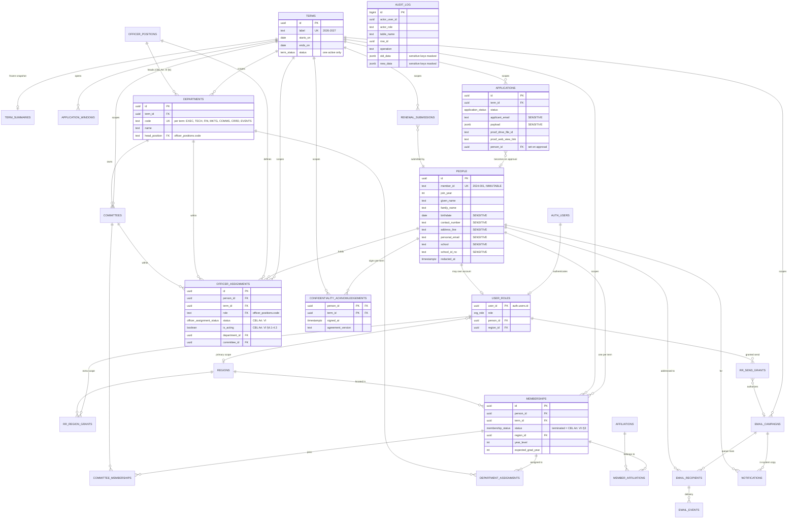

# DATA_MODEL.md — START-SYS

Authoritative schema reference for START-SYS. Companion to `PRD.md` (scope) and `ARCHITECTURE.md` (stack, auth, RLS policy text, runbooks).

Triggered by the framework rule: *"`DATA_MODEL.md` — schema has >5 entities OR relations get complex."* START-SYS has 28 tables and the term-scoping relation is the load-bearing decision in the whole system.

---

## TL;DR (read this first)

- **PostgreSQL 17 on Supabase Pro (`ap-southeast-1`). No ORM.** Schema lives in plain `.sql` files in `supabase/migrations/`, applied by CI on merge to `main`. Never clicked into the dashboard.
- **Identity is split from membership.** `people` = one row per human, forever (member ID, join year, PII). `memberships` = one row per person **per term** (status, region, year level). Everything that changes annually hangs off `memberships` or carries a `term_id`.
- **`people.member_id` (`2024-001`) is immutable.** It is not on `memberships`, so renewal has no code path that could renumber anyone. Enforced by a `BEFORE UPDATE` trigger + `CHECK` + a counter table, not by application discipline.
- **Archival is a status flip, never a data migration.** No `_archive` tables, no annual ETL. `terms.status` goes `active → archived`; `current_term_id()` is what every dashboard filters on. "Dashboards are wiped clean" is free because the new term genuinely has zero memberships on day one.
- **No `DELETE` policy exists anywhere.** Membership end is a status change. Term end is a flag. Accidental mass deletion is structurally impossible.
- **RA 10173 5-year purge is anonymization-in-place**, driven by a `sensitive_column_registry` table so the classification is data, not prose in a doc nobody re-reads in 2031.
- **The Constitution is seeded, not paraphrased.** The 23 CBL positions and the seven departments are rows in `0016_seed.sql` with articles cited inline; the **seven** administrators (CRRD SRS 2026-09-05, migration `0036`, ADR 0009 — CEO, COO, CTO, DCTO-PD, CCDO, DCCDO-C, DCCDO-D) are a CHECK; the May term boundary is a CHECK. **Separation from office (CBL Art. VI) and termination of membership (CBL Art. VII) are two different enums** on two different tables, because they are two different Articles with two different deciding bodies — §3.1 and §3.4.
- **RLS is the enforcement boundary.** Policy text lives in `supabase/migrations/0014_rls.sql` and is explained in `ARCHITECTURE.md`; this file shows only the policies that are part of the *modelling* (e.g. the application-window gate).

> **If your query returns nothing, read `ARCHITECTURE.md` § "If your query returns nothing, read this first."** RLS's failure mode is a silent empty result set, not an error. This surprises everyone exactly once.

---

## 1. Entity index

**Legend:** `SCOPE` — `global` (reference data), `person` (durable, per-human-forever), `term` (per academic year), `event` (append-only log/queue).
**Source:** `PRD` = stated in the PRD · `ADD` = PRD addendum (proof of enrollment) · `CBL` = fixed by the START-DOST Constitution and By-Laws 2026 (cited inline) · `LOCK` = named in the locked stack decision · `EXT` = extrapolation, justified in the row.

> **The CBL is the authority for org structure, tenure, separation from office and membership termination.** The PRD says so itself: *"The system will follow the CBL in terms of member status and organizational structure."* Where a row below reads `CBL`, the shape is not ours to choose — changing it needs a constitutional amendment (CBL Art. XII), not a migration.

| # | Table | Scope | Source | Purpose (one line) |
|---|---|---|---|---|
| 1 | `auth.users` | person | LOCK | Supabase GoTrue-managed. Credentials, email verification, TOTP factors, sessions. **We never write it directly.** |
| 2 | `user_roles` | person | LOCK | Account → RBAC role → person/region binding. The thing `auth_role()` reads. Not `user_metadata`. |
| 3 | `people` | **person** | PRD | One row per human, forever. Member ID, join year, and every sensitive PII column, deliberately isolated here. |
| 4 | `member_id_counters` | global | LOCK | `join_year → last_seq`. Race-safe allocation of `2024-001`. |
| 5 | `terms` | term | PRD | Academic year. `label`, `starts_on`, `ends_on`, `status`. Exactly one `active` at a time, enforced by a unique partial index. |
| 6 | `term_summaries` | term | LOCK | Frozen headcount snapshot per term, written by `roll_over_term()`. Historical dashboards without re-scanning archived rows. |
| 7 | `memberships` | **term** | PRD | **The PRD's "one membership record per term."** `(person_id, term_id)` unique. Status, region, year level, expected grad year. |
| 8 | `regions` | global | PRD | 18 Philippine regions, each with an `island_group`. Reference data, not term-scoped. |
| 9 | `departments` | term | PRD+CBL | The **seven** standing departments of CBL Art. III §4, term-scoped rows with a stable cross-term `code` and the `head_position` that heads each. Seven is constitutional, not configurable. |
| 10 | `committees` | term | PRD | Committees, term-scoped, optionally owned by a department. |
| 11 | `department_assignments` | term | PRD | Membership → department. The PRD's "assign members to departments." |
| 12 | `committee_memberships` | term | PRD | Membership → committee. The PRD's "assign members to committees." |
| 13 | `officer_positions` | global | **CBL** | The 23 positions of CBL Art. III §2 (C-Suite + Special Advisor), §3 (Deputy Board), §4.6 (Regional Representative) and §5 (Committee Member), and the `org_role` each grants. Seeded verbatim from the Constitution — see §6/0016. |
| 14 | `officer_assignments` | **term** | PRD+CBL | Who holds which position, **this term**, and their standing under CBL Art. VI (`active`/`on_leave`/`suspended`/`resigned`/`dismissed`/`impeached`/`ended`). Roles are rows with a term attached, never a column on the account. |
| 15 | `affiliations` | global | PRD | Named partnerships ("START x DataCamp"). A table, so a new partnership needs no code change. |
| 16 | `member_affiliations` | term | LOCK | `membership ↔ affiliation`. Attached to the **membership**, so a cohort is a fact about a term. |
| 17 | `applications` | term | PRD+ADD | External membership applications. Applicant PII, proof-of-enrollment Drive pointers, review outcome. |
| 18 | `application_windows` | term | LOCK | `(term_id, form_kind, opens_at, closes_at)`. The anon INSERT policy reads this, so "the period is closed" is a DB fact, not a hidden link. |
| 19 | `renewal_submissions` | term | PRD | Renewal form submissions by existing people. Separate from `applications` because the actor and the RLS policy are different. |
| 20 | `rr_region_grants` | person | LOCK | Extra regions a regional rep may see beyond their primary. |
| 21 | `rr_send_grants` | event | PRD | CRRD's "go signal" for a regional rep to send, as an **expiring row with an audit trail**. |
| 22 | `email_campaigns` | term | PRD | One row per compose+send. Template kind, subject, body, frozen audience filter, status. |
| 23 | `email_recipients` | event | LOCK | **The rows are the send queue.** One per resolved person, frozen merge payload, `UNIQUE(campaign_id, person_id)`. |
| 24 | `email_events` | event | LOCK | Resend delivery webhooks: delivered / bounced / complained. |
| 25 | `email_suppressions` | global | EXT | Hard-bounce and complaint suppression list. Follows from the locked stack's "auto-suppressing hard bounces"; without it the same dead address is retried on every campaign forever. |
| 26 | `notifications` | term | PRD | In-system notifications. Required by the PRD user flow: *"Admin can send forms out to members through notifications from the system (e.g. Call for Committee Members)."* |
| 27 | `audit_log` | event | PRD | Append-only. Who changed what, when. Sensitive values are masked at write time — see §8. |
| 28 | `sensitive_column_registry` | global | EXT | The RA 10173 classification, **as data**. Drives both audit masking and the 5-year purge, so the two can never disagree. |
| 30 | `programs` | global | SRS | The thirteen accredited programs (CRRD SRS 2026-09-05, CBL Art. I §4), a closed list — PRD OQ-17 resolved. Rows, not code; `is_active` retires, nothing deletes. (0037) |
| 31 | `universities` | global | SRS | Institutions by region, a starter list pending the DOST-SEI eligible-institution list. CRRD edits; the RR view filters by it. (0037) |
| 29 | `confidentiality_acknowledgements` | **term** | **CBL** | CBL Art. VIII §7.1: *"All elected and appointed officers, committee members, and advisors shall sign a Confidentiality Agreement"* — §7 requires it *"upon assuming their roles."* One row per person per term. Precondition for every sensitive-column read — see §8.4. |

### 1.1 Requested entities that are deliberately NOT tables

| Requested | Resolution | Why |
|---|---|---|
| `proof_of_enrollment` | Two columns on `applications`: `proof_drive_file_id`, `proof_web_view_link` | Exactly one document per application, mandatory, same lifecycle. A 1:1 table adds a join and an orphan state for nothing. PRD addendum says "stores and displays the corresponding file link **against the applicant's record**." |
| `island_groups` | `island_group` enum column on `regions` | Three values, fixed by Philippine geography, never edited by a user. A table would be three rows and a join on every recipient filter. |
| `roles` / `permissions` | `org_role` enum + `user_roles` table; **permissions are the RLS policies** | A `permissions` table is a second permission model that drifts out of sync with the one Postgres actually enforces. The pgTAP suite is the readable, executable permission spec. `officer_positions` covers *titles*; `org_role` covers *capability*. |
| `form_sends` | An `email_campaigns` row with `form_kind` set | The locked stack: *"a 'form' is a campaign whose template contains a link."* All three PRD form types run on one mechanism. A second table would need its own recipient resolution, queue and delivery reporting. |
| `sessions` | `auth.sessions`, GoTrue-managed | Writing our own session table means writing our own session invalidation. Membership end calls `auth.admin.signOut(user_id, 'global')`. |
| `*_archive` tables | `terms.status = 'archived'` | Duplicating the schema means maintaining two of everything, and an annual migration job is broken 100% of the time it matters. See §7. |
| `committee_applications` | **Not modelled.** | The PRD requires CRRD to *send* the Committee Application Form; it does not require the system to *collect* the responses (Application Management names membership applications only). If CRRD wants in-system collection, it is one additive table with zero changes elsewhere — which is the Extensibility NFR demonstrated rather than asserted. Not an open question; if it is ever requested it needs an ADR in `docs/decisions/`, not a schema guess now. |
| events / budgets / files / analytics | Excluded | PRD Constraints: *"does not include operations management, event management, financial management, file storage or advanced analytics."* |

---

> **Amended 2026-09-05/06 — the CRRD SRS membership form (migrations `0037`–`0041`).** The application form is the SRS's: sex, Facebook account link, DOST scholarship award and year of award, **university and program chosen from two new reference tables** (`universities` by region, `programs` — the closed thirteen-item list, closing OQ-17), year level 1–5, and **two documents** — the latest registration form (the proof columns) and the **Notice of Award** (four `noa_*` columns on `applications`, mirrored contract). Address and school ID are no longer collected; the columns stay. New member IDs pad to four digits (`2026-0001`). Where the text below still describes the single-document, address-bearing form, this note wins.

## 2. THE core decision: per-term vs per-person-forever

Everything else in this schema falls out of this one split. Get it wrong and either (a) member IDs get renumbered on renewal, or (b) last year's officer list overwrites this year's.

### 2.1 The rule

> **A fact lives on `people` if and only if it would still be true of that human if START-DOST ceased to exist.**
> Everything else carries a `term_id`.

### 2.2 The split, column by column

| Fact | Lives on | Why |
|---|---|---|
| Name, birthdate, contact number, address, personal email | `people` | Properties of a human, not of a membership. |
| **Member ID (`2024-001`)** | `people` | The PRD's hard rule. See §4 — this placement *is* the enforcement. |
| Join year | `people` | The year they first joined, forever. Also the PRD's email filter axis "year of membership". |
| School, school ID number | `people` | Durable in practice; corrected in place on transfer rather than versioned. <!-- decision: boring option. PRD does not require school history. If a shiftee/transferee history is ever needed it is an additive `people_school_history` table, no changes elsewhere. --> |
| **Membership status** (Active/Graduated/Resigned/…) | `memberships` | A person can be Active in 2025-2026 and Graduated in 2026-2027. Status without a term is meaningless. |
| Region | `memberships` | Scholars relocate. The RR who could see them in 2025 should not automatically see them in 2027. |
| Year level, expected graduation year | `memberships` | Changes every single term by definition. Feeds the renewal-eligibility predicate. |
| **Officer position** (CEO, CCDO, …) | `officer_assignments` | The entire leadership changes annually (CBL Art. V §1: terms run to May of the succeeding year). "Who is CCDO" must be a question with a term in it. A `role` column on the account cannot answer "who was CCDO in 2024-2025". |
| **Standing in office** (LOA, suspended pending impeachment, dismissed, impeached) | `officer_assignments.status` | CBL Art. VI is titled *Separation from **Office***. A leave of absence and an impeachment suspend or end an **assignment**, not a membership: an impeached CTO is still a member (Art. VI §3.3 disqualifies them from *holding any position*, not from the organization). Keeping these off `memberships.status` is what stops "on leave" from silently revoking a member's portal access. |
| **Termination of membership** (Art. VII §3) | `memberships.status = 'terminated'` | The other direction of the same wall. Removal *from the organization* is a membership fact, decided by a majority vote of the Executive Board — a different body, a different process, and a different table from Art. VI. |
| **Confidentiality agreement signed** | `confidentiality_acknowledgements` (person × term) | CBL Art. VIII §7 requires the agreement *"upon assuming their roles"* (§7.1 names who signs) — roles are assumed each term, so a person-scoped column would keep asserting a 2024 signature forever. See §8.4. |
| Committee / department assignment | `committee_memberships`, `department_assignments` | Reassigned every term. |
| Affiliation ("START x DataCamp") | `member_affiliations` → `memberships` | A cohort is a fact about a term, not a permanent label. *(Open question — confirm with CRRD before the first campaign filters on it.)* |
| RBAC role (`org_role`) | `user_roles` (person-scoped, current only) | Deliberately **not** term-scoped: it is the live access-control answer and must revoke instantly on graduation. The *history* of who held what is in `officer_assignments` + `audit_log`. |

### 2.3 What this buys, concretely

| PRD requirement | Falls out for free |
|---|---|
| "System creates a membership record per term" | `memberships (person_id, term_id) UNIQUE` is literally that sentence. |
| "2024-001 will not become 2025-001" | Renewal inserts a `memberships` row and never touches `people`. There is no code path to renumber. |
| "Dashboards are wiped clean" | Dashboards filter `term_id = current_term_id()`. New term = zero rows. Nothing is deleted. |
| "Their records will remain archived" | The old rows never moved. |
| "Preserve and retrieve member records across multiple terms" | `SELECT … WHERE person_id = $1 ORDER BY term.starts_on` is the member's whole history. |
| "Log … officer role changes" | `officer_assignments` is a table with an audit trigger, not a mutated column. |

### 2.4 The rejected alternative

A single `members` table with `status`, `region`, `committee`, `role` and `term` columns, re-created or overwritten each year.

It fails on the PRD's own words: overwriting loses history ("records across terms are preserved"), and re-creating a row per term means the member ID travels with the term row, which is exactly how `2024-001` becomes `2025-001`. Every convenience it offers is recovered by the `v_member_directory` view.

---

## 3. Enums and legal state transitions

```sql
create type public.org_role          as enum ('exec_admin','tech_admin','crrd_admin','moderator','officer','regional_rep','member');
-- AS AMENDED 2026-09-05 (CRRD SRS, migration 0036, ADR 0009):
--   exec_admin   CEO, COO
--   tech_admin   CTO, DCTO-PD
--   crrd_admin   CCDO, DCCDO-C, DCCDO-D
--   officer      every other Chief and Deputy, read-only
--   regional_rep Regional Representatives
--   member       the REVOKED state only — members hold no accounts ("Members cannot access
--                the system. They can only submit via forms"); written by revoke_role
--   moderator    RETIRED — the label cannot be dropped, so user_roles_no_retired_tier refuses it
-- Administrators are the seven above (admin_is_srs_administrator CHECK). Nobody else.
create type public.island_group      as enum ('Luzon','Visayas','Mindanao');
create type public.term_status       as enum ('draft','active','archived');

-- MEMBERSHIP: belonging to the organization. CBL Art. VII.
create type public.membership_status as enum
  ('renewal_pending','active','graduated','resigned','left','terminated');
-- 'terminated' is CBL Art. VII §3 -- removal from the organization by a majority vote
-- (50%+1) of the Executive Board. It is NOT the same event as 'left' (renewal declined
-- or lapsed) and NOT the same as an impeachment, which ends an OFFICE, not a membership.

-- OFFICE: holding a position. CBL Art. VI is titled "Separation from Office" and applies
-- to Executive Board, Deputy Board and Committee members -- never to plain membership.
create type public.officer_assignment_status as enum
  ('active','on_leave','suspended','resigned','dismissed','impeached','ended');
-- on_leave    Art. VI §1  -- approved LOA, max 30 days per term, approved by the CEO.
-- suspended   Art. VI §3.2.3 -- the accused "shall immediately be put on indefinite LOA,
--             without going through the processes defined in Article VI, Section 1",
--             until the case is resolved. A separate value precisely because the CBL
--             says it is not a §1 leave: it is indefinite and must not consume the cap.
-- resigned    Art. VI §2  -- voluntary, approved by the CEO (or Exec Board if the CEO).
-- dismissed   Art. VI §1.7 -- automatic dismissal after an unanswered AWOL notice.
-- impeached   Art. VI §3.2.7 -- majority vote of the Executive Board; ruling is "final
--             and irrevocable" (§3.2.8), so this value has no outbound edge at all.
-- ended       Art. V §1.3.3 death, Art. VI §4 permanent incapacity or analogous cause.
--             NOT ordinary term expiry -- that is terms.status = 'archived' (§7).
-- There is no 'vacant' value: CBL Art. VI §4 vacancy is the ABSENCE of a sitting
-- assignment for a (term, position), which is a query, not a state. See §3.4.
create type public.application_status as enum ('draft','pending','approved','rejected');
create type public.form_kind         as enum ('membership_application','committee_application','membership_renewal','freeform');
create type public.campaign_status   as enum ('draft','queued','sending','sent','failed');
create type public.recipient_status  as enum ('queued','sent','failed','suppressed');
create type public.email_event_type  as enum ('delivered','opened','clicked','bounced','complained');
```

### 3.1 `membership_status` — the PRD's "Active, Graduated, Resigned", plus the CBL's termination

`left` covers the PRD's third termination cause ("graduate, resign **or leave** the organization"). `renewal_pending` is the state of a *new term's* row between renewal submission and CRRD approval. **`terminated` is new, and forced by CBL Art. VII §3** — see the note below.

There is no `expired` or `lapsed` value. CBL Art. VII §1: membership *"shall remain valid from the notice of their membership until the end of term as defined in Article V, Section 1."* Membership expiring at term end is not a status change; it is the term-scoped row itself running out. That is the whole point of §2.

```
                    (renewal form submitted, new term)
        ─────────────────► renewal_pending ──approve──► active
                                  │
                                  └──decline/expire──► left   (terminal)

        active ──graduation confirmed──► graduated   (terminal for this term)
        active ──member resigns────────► resigned    (terminal for this term)
        active ──removed / lapsed──────► left        (terminal for this term)
        active ──Exec Board vote, ─────► terminated ─┐ (CBL Art. VII §3)
                 CBL Art. VII §3.2.3                 │
                       ▲                             │
                       └── appeal upheld ────────────┘ (CBL Art. VII §3.2.5-3.2.6)
```

| From → To | Allowed | Actor | Notes |
|---|---|---|---|
| *(none)* → `active` | ✅ | `approve_application()` | New member. Mints member ID in the same transaction. |
| *(none)* → `renewal_pending` | ✅ | member, via renewal form | Only while a `membership_renewal` window is open **and** the person was `active` in the immediately preceding term. |
| `renewal_pending` → `active` | ✅ | `crrd_admin`, `moderator`, `exec_admin` | |
| `renewal_pending` → `left` | ✅ | `crrd_admin`, `moderator`, `exec_admin`, or the rollover sweep | Declined or never completed. |
| `active` → `graduated` \| `resigned` \| `left` | ✅ | `crrd_admin`, `moderator`, `exec_admin` | Triggers `auth.admin.signOut(user, 'global')` in the same Server Action. |
| `active` → `terminated` | ✅ | **`exec_admin` only** | CBL Art. VII §3.2.3: *"A simple majority vote (50% + 1) of the Executive Board is required for termination to be enacted."* `moderator` and `crrd_admin` are deliberately **narrowed out** — the locked role model lets a moderator "update member status", but the Constitution reserves this one status to the Executive Board. Also signs the user out globally. |
| `terminated` → `active` | ✅ | **`exec_admin` only** | CBL Art. VII §3.2.5-3.2.6: the member may appeal to the Special Advisor within five working days, who *"may recommend reconsideration."* **The only reversal edge anywhere in this schema.** Without it a successful appeal would be unrepresentable and CRRD would fake it with a second `people` row — which is exactly how a member gets a second member ID. Cheap to allow: unlike `applications.approved`, reversing this mints nothing. |
| `graduated` \| `resigned` \| `left` → anything | ❌ | — | Terminal **within that term**. A returning member gets a *new row in a new term* and keeps their original `member_id`. Enforced by `enforce_membership_transition()`. |
| any → any, on an `archived` term | ❌ | — | Blocked by `reject_write_to_archived_term()`. See §7.3. |

> **Why `terminated` is not just `left`.** Art. VII §3 grounds (harassment or discriminatory conduct; non-compliance with rules; loss of DOST scholarship status; failure to maintain eligibility) reach an *adjudicated* outcome with an appeal window, initiated by the Executive Board or by written complaint. `left` is the non-adjudicated exit — renewal declined, quietly stopped participating. Collapsing them means (a) an Executive Board decision is indistinguishable from an unreturned renewal form in the audit log, and (b) the write privilege cannot be narrowed to `exec_admin`, because `left` legitimately belongs to `moderator`. The free-text `ended_reason` column is CRRD's note, **not** a substitute for the distinction: you cannot write an RLS policy against free text.
>
> **What is deliberately NOT modelled.** The Art. VII §3.2 procedure — written notice, five working days to respond or request a hearing, the Executive Board meeting, notification within three working days, the five-working-day appeal window, escalation to DOST-SEI — is *process*, not schema. The system records the outcome and audits who set it. Building a case-management workflow for an event that happens perhaps once a year would be a second application inside this one. If it is ever wanted it is one additive `disciplinary_cases` table and nothing else changes.

**Access consequence** (from the locked auth model): the member portal's RLS requires an `active` membership in `current_term_id()`. The single carve-out is `renewal_submissions`, which a person with *any* past membership may insert into while a renewal window is open. The PRD's *"no access to any part of the website unless it's for membership renewal"* is therefore two policies, not an `if` someone can forget to write.

### 3.2 `application_status`

```
draft ──proof uploaded + submit──► pending ──review──► approved  (terminal)
  │                                   └──review──────► rejected  (terminal)
  └── abandoned: redacted by the monthly job after 30 days
```

`draft` exists only because the Drive upload path needs an application row to exist before the browser PUTs the file (§6). The applicant never sees the word "draft"; on submit they see the PRD's *"success notification and pending status"*.

> **Reconciliation note.** The locked stack's Drive section calls the post-upload state `submitted` while its data-layer section names the enum `pending|approved|rejected`. This file adopts `pending` as the enum value (matching the PRD's own vocabulary) and treats "submitted" as prose for the `draft → pending` flip. Same state, one name.

`approved` is terminal and irreversible from the UI: reversing it would orphan a minted member ID. A genuine mistake is corrected by setting the resulting `memberships.status = 'left'`, which leaves an audit trail.

### 3.3 `term_status`

```
draft ──roll_over_term()──► active ──roll_over_term() (next year)──► archived
      (tech_admin)                  (tech_admin)                         │
                              ▲                                          │
                              └────── unfreeze_term() (tech_admin, audited, temporary)
```

Exactly one `active` term at any instant, enforced by `CREATE UNIQUE INDEX one_active_term ON terms (status) WHERE status = 'active'`.

### 3.4 `officer_assignment_status` — CBL Art. VI, "Separation from Office"

The enum the schema was missing. Art. VI is a wholly separate régime from Art. VII: different subjects (officers, not members), different deciding body per state, and — crucially — **an officer separated from office is still a member**. Art. VI §3.3 disqualifies an impeached officer from *"holding any position within the organization"*; it does not remove them from START-DOST. Putting these values on `memberships.status` would revoke a member's portal access for taking a two-week leave.

```
              ┌──── return from leave (Art. VI §1.3) ────┐
              ▼                                          │
   ─────► active ──CEO approves LOA (§1.2)──────────► on_leave
            │  │
            │  └──impeachment complaint filed (§3.2.3)─► suspended ──guilty (§3.2.7)──► impeached
            │                                               │                          (final and
            │        ◄──── acquitted / complaint dropped ───┘                          irrevocable)
            ├──resignation approved by CEO (§2.2)───► resigned
            ├──AWOL notice unanswered (§1.7)────────► dismissed
            └──death / permanent incapacity (§4)────► ended
```

| From → To | Allowed | Actor | CBL basis |
|---|---|---|---|
| *(none)* → `active` | ✅ | `exec_admin` | Art. V §2 appointment; Art. VI §4.1-4.3 mid-term filling of a vacancy. |
| `active` → `on_leave` | ✅ | `exec_admin` | Art. VI §1.2 — *"The CEO shall acknowledge, approve, and issue a notice of LOA."* Approval is the CEO's alone; there is no CBL reading under which a `moderator` grants an officer leave. |
| `on_leave` → `active` | ✅ | `exec_admin` | Art. VI §1.3 return, §1.4 early return. |
| `on_leave` → `dismissed` | ✅ | `exec_admin` | Art. VI §1.5.4 — non-return from LOA is AWOL, §1.7 is the dismissal. |
| `active` \| `on_leave` → `suspended` | ✅ | `exec_admin` | Art. VI §3.2.3 — automatic on receipt of the complaint, *before* any ruling. |
| `suspended` → `impeached` | ✅ | `exec_admin` | Art. VI §3.2.7 — majority (50%+1) of the Executive Board excluding complainant and accused. |
| `suspended` → `active` | ✅ | `exec_admin` | Not impeached. Art. VI §3.2.8 requires a ruling within two weeks either way; acquittal has to restore the officer or the "indefinite LOA" becomes a dismissal by inaction. |
| `active` \| `on_leave` → `resigned` | ✅ | `exec_admin` | Art. VI §2.2 — approval rests with the CEO (or a simple majority of the Executive Board if the resigning member *is* the CEO). |
| `active` \| `on_leave` → `dismissed` | ✅ | `exec_admin` | Art. VI §1.7. |
| any → `ended` | ✅ | `exec_admin` | Art. V §1.3.3 (death), Art. VI §4 (permanent incapacity or analogous cause). |
| `impeached` → anything | ❌ | — | Art. VI §3.2.8: the ruling *"shall be deemed final and irrevocable."* The one state in the whole schema the Constitution itself declares terminal. Art. X §2.5 does let the Special Advisor review an appeal *"from members or officers subjected to disciplinary action"* and *"recommend reconsideration or escalation to DOST-SEI"*, but that escalation runs **outside** the organization, and Art. VI §3.3 independently disqualifies the person from holding any position — so it produces no edge here and no new assignment row either. Contrast Art. VII §3, where the appeal is given an in-org remedy and the schema has one. |
| `resigned` \| `dismissed` \| `ended` → anything | ❌ | — | Terminal within the term. Re-appointment is a **new row**, and Art. VI §1.7 / §3.3 bar it for dismissal and impeachment anyway. |
| any → any, on an `archived` term | ❌ | — | `reject_write_to_archived_term()`. |

**Every transition is written by `exec_admin` and, since ADR 0012 (2026-09-06, migration 0046), `crrd_admin`.** The `Actor` column above still reads `exec_admin` because it names who Art. VI makes the *decider* — the CEO or the Executive Board — and that has not moved. ADR 0012 widens only who may *record* that a decision was made: CRRD asked to be the org's HR-records desk for any position, the same recorder/decider split already in use for the DCOO/AWOL divergence below, generalized to a second holder. `officer` remains SELECT-only and `tech_admin` remains refused (configuring the system is not recording who holds a CBL position). See `075_officer_assignments_crrd.sql` for the pgTAP proof.

> **One divergence worth flagging, not silently fixing.** CBL Art. VI §1.6 makes the **DCOO** the officer who issues a formal AWOL notice. Under the locked role model the DCOO is `officer` — SELECT only. So the notice is issued by the DCOO *outside* the system and the resulting `dismissed` flip is recorded by an `exec_admin`, with the DCOO named in `status_note`. The alternative — giving the DCOO write access to `officer_assignments` — would be a quiet fifth administrator, which the project heads' decision of 2026-09-01 forecloses. Raise it with them if the DCOO wants to record their own notices.

**Vacancy is a query, not a status.** CBL Art. VI §4: *"A vacancy of position happens when a member … is unable to continue serving due to LOA, dismissal, resignation, impeachment, permanent incapacity, or any analogous cause."* That is precisely `NOT EXISTS (select 1 from officer_assignments where term_id = $1 and role = $2 and status = 'active' and not is_acting)`. Modelling `vacant` as an enum value would mean a row that claims someone holds a position nobody holds.

**Acting officers get a column, because they get powers.** Art. VI §4.1 (the COO assumes the CEO's duties), §4.2 (the CEO designates an acting officer from the deputies of the concerned department) and §4.3 (the Chief absorbs a vacant deputy's duties) are not paperwork: if the CTO resigns in November, someone has to be able to run `roll_over_term()` in May. `officer_assignments.is_acting` records the designation; `user_roles` — still the live access-control answer, per §2.2 — is what actually grants `tech_admin` for the duration. The assignment row is the *why*, the `user_roles` row is the *what*, and the audit log has both.

**What is deliberately NOT modelled — the clocks.** Art. VI is full of durations: the 30-day-per-term LOA cap, the five-day notice of intent, the CEO's two-day acknowledgement, "more than three consecutive meetings", "more than two weeks" of non-responsiveness, the five-day AWOL reply window, the ten-day resignation notice, the two-day impeachment notification, the five-day deliberation, the two-week ruling deadline, the ten-day window to fill a vacancy. **None of them is enforced by this schema.** Two reasons, and they are different reasons:

1. *The cap is not computable from what we store, on purpose.* Art. VI §1 counts leave *"from Monday to Saturday, excluding national holidays"*. Philippine national holidays are set by annual presidential proclamation. Enforcing 30 days therefore needs a per-day leave ledger **and** a holiday calendar maintained every year by someone who will have graduated. A cap that is silently wrong is worse than no cap: it would reject a legitimate leave and be debugged by disabling the check. If the org ever wants it, it is one additive `officer_leaves (assignment_id, starts_on, ends_on)` table plus a holiday source — the enum above does not change.
2. *The rest are notice periods between humans.* A ten-day resignation letter and a two-day acknowledgement are obligations on the CEO, not invariants of a database. The system records the outcome, stamps who did it and when, and lets the audit log answer "was this done on time?" after the fact.

---

## 4. The member ID rule, modelled

> PRD: *"Members will have a specific ID number containing the year they joined, (e.g. 2024-001), when membership renewal / application begins, those with existing IDs will not be assigned new ones (e.g. 2024-001 will not become 2025-001)."*

Four independent mechanisms. **None of them is application code.**

**1. Structural — the ID is not on the thing that changes.**
`member_id` is a column on `people`. Renewal inserts a `memberships` row. `people` is not touched. There is no code path that could renumber a member, because the number is not on the per-term record.

**2. Concurrency-safe allocation via a counter table.**

```sql
create table public.member_id_counters (
  join_year int primary key,
  last_seq  int not null default 0 check (last_seq >= 0)
);

insert into public.member_id_counters (join_year, last_seq)
values (p_year, 1)
on conflict (join_year)
do update set last_seq = public.member_id_counters.last_seq + 1
returning last_seq into v_seq;
```

One statement, one row-level exclusive lock. Two CRRD deputies approving simultaneously serialize on it and get distinct sequences.

- **Not `max(seq)+1`** — classic lost-update race under concurrent approval.
- **Not a per-year `SEQUENCE`** — needs runtime DDL every January, and sequences are non-transactional, so a failed approval permanently burns `2027-004`. The counter row rolls back with its transaction.

**3. Idempotent and gated.** `allocate_member_id()` early-returns any existing `member_id`, so a retried approval is safe. It is reachable **only** through `approve_application()` (`SECURITY DEFINER`). No human role holds `INSERT` on `people`, so ID assignment + membership creation + audit row are one transaction: you can never get an ID without a membership, or a membership without an ID.

**4. Enforced at the table.**

```sql
alter table public.people
  add constraint member_id_format check (member_id ~ '^\d{4}-\d{3,}$');
```

plus a `BEFORE UPDATE` trigger that raises if `OLD.member_id IS NOT NULL AND NEW.member_id IS DISTINCT FROM OLD.member_id`. Even a panicked `psql` session at 2am cannot renumber a member.

`lpad(seq, 3, '0')` with a `{3,}` regex means the 1000th member of a year becomes `2024-1000`, not a collision.

**Tests (CI-blocking):** a Vitest unit test for the allocator, and a pgTAP concurrency test firing 50 parallel approvals and asserting 50 distinct IDs.

---

## 5. ER diagram



`AUDIT_LOG`, `MEMBER_ID_COUNTERS`, `EMAIL_SUPPRESSIONS` and `SENSITIVE_COLUMN_REGISTRY` are intentionally shown without FK edges — they reference rows by `(table_name, row_id)` or by natural key so that no cascade or dependency can ever block a write to the tables they observe.

---

## 6. Schema DDL

Plain SQL, applied by CI. `supabase gen types typescript` produces `database.types.ts`, committed and verified in CI, so the schema is the source of truth for TypeScript types.

```
supabase/migrations/
  0001_extensions.sql        0009_regional.sql
  0002_enums.sql             0010_email.sql
  0003_reference.sql         0011_audit.sql
  0004_identity.sql          0012_functions.sql
  0005_terms.sql             0013_views.sql
  0006_membership.sql        0014_rls.sql
  0007_org_structure.sql     0015_grants.sql
  0008_applications.sql      0016_seed.sql
```

### 0001 — extensions

```sql
create extension if not exists pg_trgm;   -- trigram index for member name search (Search & Filtering FR)
create extension if not exists pgtap;     -- RLS test suite; CI only, harmless in prod
-- gen_random_uuid() is core in PG13+; no pgcrypto needed.
```

### 0003 — reference data (global, not term-scoped)

```sql
create table public.regions (
  id           uuid primary key default gen_random_uuid(),
  code         text not null unique,              -- 'NCR','R04A','BARMM','NIR'
  name         text not null unique,
  island_group public.island_group not null,
  sort_order   int  not null
);

create table public.affiliations (
  id         uuid primary key default gen_random_uuid(),
  code       text not null unique,                -- 'START_X_DATACAMP'
  name       text not null,
  is_active  boolean not null default true,
  created_at timestamptz not null default now()
);

create table public.officer_positions (
  code             text primary key,              -- CBL Art. III §2, §3, §4.6, §5; seeded in 0016
  title            text not null,                 -- verbatim from the Constitution
  grants_org_role  public.org_role not null,      -- provisioning hint; user_roles is still written explicitly
  is_administrator boolean not null default false,
  sort_order       int not null                   -- CBL listing order, in tens, so an amendment inserts
);

-- The administrators are a DATABASE constraint, not a comment nobody re-reads.
-- 0003 named four (project heads, 2026-09-01: CEO, COO, CTO, CCDO); 0036 replaced the CHECK
-- with admin_is_srs_administrator naming SEVEN (CRRD SRS, 2026-09-05: + DCTO_PD, DCCDO_C,
-- DCCDO_D). An eighth requires a migration with a named author, which is the point.
alter table public.officer_positions add constraint admin_is_c_suite
  check (not is_administrator or code in ('CEO','COO','CTO','CCDO'));

create table public.sensitive_column_registry (
  table_name  text not null,
  column_name text not null,
  rationale   text not null,
  primary key (table_name, column_name)
);
```

### 0004 — identity (per-person-forever)

```sql
create table public.people (
  id              uuid primary key default gen_random_uuid(),
  member_id       text unique
                  constraint member_id_format check (member_id ~ '^\d{4}-\d{3,}$'),
  join_year       int  not null check (join_year between 2000 and 2100),

  given_name      text not null check (length(btrim(given_name)) > 0),
  middle_name     text,
  family_name     text not null check (length(btrim(family_name)) > 0),
  suffix          text,

  -- SENSITIVE (RA 10173). Isolated on this table on purpose: one targeted
  -- UPDATE performs the 5-year purge, and column-level GRANTs have one place to apply.
  birthdate       date,
  contact_number  text,
  personal_email  citext,
  address_line    text,
  city_municipality text,
  province        text,
  postal_code     text,
  school          text,
  school_id_no    text,

  redacted_at     timestamptz,                    -- set by redact_expired_pii()
  created_at      timestamptz not null default now(),
  updated_at      timestamptz not null default now()
);

create index people_name_trgm on public.people
  using gin ((given_name || ' ' || family_name) gin_trgm_ops);
create index people_join_year on public.people (join_year);

create table public.member_id_counters (
  join_year int primary key,
  last_seq  int not null default 0 check (last_seq >= 0)
);

create table public.user_roles (
  user_id    uuid primary key references auth.users(id) on delete cascade,
  role       public.org_role not null,
  person_id  uuid unique references public.people(id),   -- null for a tech_admin who is not a member
  region_id  uuid references public.regions(id),         -- primary scope; required for regional_rep
  created_at timestamptz not null default now(),
  constraint rr_needs_region check (role <> 'regional_rep' or region_id is not null)
);
create index user_roles_person on public.user_roles (person_id);
```

### 0005 — terms

```sql
-- TERM BOUNDARIES — CBL Art. V §1. See §7.5 for the full reading.
--   ends_on   = 31 May. Art. V §1: officers "shall serve a term until May of the succeeding
--               year by which they were appointed". The month is constitutional; the day is
--               not stated, so the last day of the month is our reading (residual OQ-7).
--   starts_on = 1 June, the day after the outgoing ends_on. Consecutive, no gap, no overlap.
--   ONE term serves both officers and members: CBL Art. VII §1 defines membership validity
--   as running "until the end of term as defined in Article V, Section 1" -- the same
--   sentence. There is no separate academic/membership term to model.
create table public.terms (
  id         uuid primary key default gen_random_uuid(),
  label      text not null unique,                -- '2026-2027' — idempotency key for roll_over_term()
  starts_on  date not null,                       -- 2026-06-01
  ends_on    date not null,                       -- 2027-05-31
  status     public.term_status not null default 'draft',
  archived_at timestamptz,
  created_at timestamptz not null default now(),
  constraint term_dates_ordered check (ends_on > starts_on),
  -- CBL Art. V §1, enforced. A term that ends in July is unconstitutional, not a typo to
  -- discover in the rollover runbook at 2am.
  constraint term_ends_in_may check (extract(month from ends_on) = 5),
  constraint term_spans_succeeding_year
    check (extract(year from ends_on) = extract(year from starts_on) + 1)
);

-- Exactly one active term is a DATABASE invariant, not an application convention.
create unique index one_active_term on public.terms (status) where status = 'active';

create table public.term_summaries (
  term_id        uuid primary key references public.terms(id),
  counts         jsonb not null,   -- {"active":612,"graduated":88,"by_region":{...},"by_committee":{...}}
  snapshotted_at timestamptz not null default now()
);

create table public.application_windows (
  id         uuid primary key default gen_random_uuid(),
  term_id    uuid not null references public.terms(id),
  form_kind  public.form_kind not null,
  opens_at   timestamptz not null,
  closes_at  timestamptz not null,
  created_at timestamptz not null default now(),
  unique (term_id, form_kind),
  constraint window_ordered check (closes_at > opens_at)
);
```

### 0006 — membership (per-term)

```sql
create table public.memberships (
  id                 uuid primary key default gen_random_uuid(),
  person_id          uuid not null references public.people(id),
  term_id            uuid not null references public.terms(id),
  status             public.membership_status not null default 'active',
  region_id          uuid not null references public.regions(id),
  year_level         int  check (year_level between 1 and 8),
  expected_grad_year int  check (expected_grad_year between 2000 and 2100),
  ended_reason       text,                        -- free text alongside status, for CRRD notes
  created_at         timestamptz not null default now(),
  updated_at         timestamptz not null default now(),
  unique (person_id, term_id)                     -- THE PRD's "one membership record per term"
);

create index memberships_term_status_region on public.memberships (term_id, status, region_id);
create index memberships_current on public.memberships (term_id) where status = 'active';
create index memberships_person on public.memberships (person_id);

create table public.member_affiliations (
  membership_id  uuid not null references public.memberships(id),
  affiliation_id uuid not null references public.affiliations(id),
  created_at     timestamptz not null default now(),
  primary key (membership_id, affiliation_id)
);
```

### 0007 — org structure (per-term)

```sql
-- The seven standing departments of CBL Art. III §4. Term-scoped rows (the membership and
-- the chiefs change annually) with a stable cross-term `code`. The LIST is constitutional:
-- adding an eighth department needs a CBL amendment (Art. XII), not a CRRD click.
create table public.departments (
  id            uuid primary key default gen_random_uuid(),
  term_id       uuid not null references public.terms(id),
  code          text not null,                    -- 'CRRD','TECH' — stable across terms; join on this for history
  name          text not null,
  -- CBL Art. III §4: each department is "headed by a Chief Officer". Storing the head as a
  -- position code rather than a person keeps it true across the whole term even while the
  -- seat is vacant (Art. VI §4), and makes "who is the CTO this term" one join instead of
  -- a hard-coded string in the dashboard.
  head_position text not null references public.officer_positions(code),
  created_at    timestamptz not null default now(),
  unique (term_id, code)
);

create table public.committees (
  id            uuid primary key default gen_random_uuid(),
  term_id       uuid not null references public.terms(id),
  department_id uuid references public.departments(id),
  code          text not null,
  name          text not null,
  created_at    timestamptz not null default now(),
  unique (term_id, code)
);

create table public.department_assignments (
  membership_id uuid not null references public.memberships(id),
  department_id uuid not null references public.departments(id),
  created_at    timestamptz not null default now(),
  primary key (membership_id, department_id)
);

create table public.committee_memberships (
  membership_id uuid not null references public.memberships(id),
  committee_id  uuid not null references public.committees(id),
  created_at    timestamptz not null default now(),
  primary key (membership_id, committee_id)
);

create table public.officer_assignments (
  id            uuid primary key default gen_random_uuid(),
  person_id     uuid not null references public.people(id),
  term_id       uuid not null references public.terms(id),
  role          text not null references public.officer_positions(code),
  -- CBL Art. VI, "Separation from Office". See §3.4 for the transition table.
  status        public.officer_assignment_status not null default 'active',
  status_note   text,                             -- e.g. the DCOO who issued the AWOL notice (Art. VI §1.6)
  -- CBL Art. VI §4.1-4.3: the COO assumes the CEO's duties; the CEO designates an acting
  -- officer from the deputies of the concerned department; a Chief absorbs a vacant deputy.
  -- Acting service carries real powers (an acting CTO must be able to roll the term over),
  -- so it is recorded, not implied. user_roles remains the live access-control answer.
  is_acting     boolean not null default false,
  department_id uuid references public.departments(id),
  committee_id  uuid references public.committees(id),
  created_at    timestamptz not null default now(),
  unique (person_id, term_id, role, department_id, committee_id)
);
create index officer_assignments_term on public.officer_assignments (term_id, role);

-- At most one SITTING holder per position per term. CBL Art. VI §4's "vacancy" is then the
-- absence of a matching row -- which is why there is no 'vacant' enum value (§3.4).
-- REGIONAL_REP (Art. III §4.6 -- one or more per region across the 18 regions of Art. I §2;
-- the CBL sets no headcount) and COMMITTEE_MEMBER (many, Art. III §5) are the only
-- multi-seat positions in the Constitution and are excluded.
create unique index one_sitting_officer on public.officer_assignments (term_id, role)
  where status = 'active' and not is_acting
    and role not in ('REGIONAL_REP','COMMITTEE_MEMBER');
create unique index one_acting_officer on public.officer_assignments (term_id, role)
  where status = 'active' and is_acting
    and role not in ('REGIONAL_REP','COMMITTEE_MEMBER');

-- CBL Art. VIII §7.1: "All elected and appointed officers, committee members, and
-- advisors shall sign a Confidentiality Agreement" -- §7 requires it "upon assuming
-- their roles." Grain is person x term because
-- roles are assumed per term (Art. V §1) and one person may hold two positions but signs
-- once. The signed DOCUMENT is out of scope -- see §8.4.
create table public.confidentiality_acknowledgements (
  person_id         uuid not null references public.people(id),
  term_id           uuid not null references public.terms(id),
  signed_at         timestamptz not null default now(),
  agreement_version text not null,                -- 'CBL-2026-VIII-7'
  recorded_by       uuid not null,                -- auth.users.id of the exec_admin who filed it
  primary key (person_id, term_id)
);
```

> **Cross-term joins.** `departments` and `committees` are term-scoped rows carrying a stable `code`, so "CRRD" is the same department every year (`join on code`) while its membership, chiefs and committees are per-term. This satisfies the locked stack's "all term-scoped" without duplicating identity. *(Note: the locked stack's phrase "regions … departments … all term-scoped" is read as applying to departments/committees/assignments; `regions` is Philippine geography and stays global.)*

### 0008 — applications and renewals

```sql
create table public.applications (
  id                  uuid primary key default gen_random_uuid(),
  term_id             uuid not null references public.terms(id),
  status              public.application_status not null default 'draft',

  -- SENSITIVE: raw applicant submission, before a person row exists.
  applicant_email     citext not null,
  applicant_given_name  text not null,
  applicant_family_name text not null,
  payload             jsonb not null default '{}'::jsonb,   -- full validated form body (zod-shaped)

  -- Proof of enrollment (PRD addendum). Pointers only; bytes live in Google Drive.
  proof_drive_file_id  text,
  proof_web_view_link  text,
  proof_mime_type      text,
  proof_size_bytes     bigint,
  proof_verified_at    timestamptz,               -- set after server-side metadata re-fetch

  person_id           uuid references public.people(id),    -- set by approve_application()
  reviewed_by         uuid references auth.users(id),
  reviewed_at         timestamptz,
  review_note         text,
  redacted_at         timestamptz,
  submitted_at        timestamptz,
  created_at          timestamptz not null default now(),

  constraint one_application_per_email_per_term unique (term_id, applicant_email),
  constraint approved_has_person check (status <> 'approved' or person_id is not null),
  constraint pending_has_proof   check (status = 'draft' or proof_drive_file_id is not null)
);
create index applications_term_status on public.applications (term_id, status);

create table public.renewal_submissions (
  id           uuid primary key default gen_random_uuid(),
  person_id    uuid not null references public.people(id),
  term_id      uuid not null references public.terms(id),   -- the NEW term being renewed into
  payload      jsonb not null default '{}'::jsonb,
  submitted_at timestamptz not null default now(),
  unique (person_id, term_id)                               -- one renewal per person per term
);
```

### 0009 — regional representative scope and send permission

```sql
-- Extra regions beyond user_roles.region_id. Most reps will have zero rows here.
create table public.rr_region_grants (
  user_id    uuid not null references auth.users(id) on delete cascade,
  region_id  uuid not null references public.regions(id),
  granted_by uuid not null references auth.users(id),
  created_at timestamptz not null default now(),
  primary key (user_id, region_id)
);

-- The PRD's "must be given permission by CRRD officers", as an expiring row.
create table public.rr_send_grants (
  id          uuid primary key default gen_random_uuid(),
  grantee     uuid not null references auth.users(id) on delete cascade,
  region_id   uuid not null references public.regions(id),
  campaign_id uuid references public.email_campaigns(id),   -- null = any campaign until expiry
  granted_by  uuid not null references auth.users(id),
  expires_at  timestamptz not null,
  revoked_at  timestamptz,
  created_at  timestamptz not null default now(),
  constraint grant_expires_in_future check (expires_at > created_at)
);
create index rr_send_grants_live on public.rr_send_grants (grantee, region_id, expires_at)
  where revoked_at is null;
```

<!-- decision: the locked stack names BOTH user_roles.region_id and rr_region_grants. Resolved as:
     user_roles.region_id is the rep's primary region and is what auth_region_id() returns, so every
     locked policy written as `region_id = auth_region_id()` stands unchanged. auth_region_ids()
     returns primary UNION grants, and new policies should prefer `= ANY(auth_region_ids())` because
     it degenerates correctly to the single-region case. -->

### 0010 — email, notifications

```sql
create table public.email_campaigns (
  id             uuid primary key default gen_random_uuid(),
  term_id        uuid not null references public.terms(id),
  form_kind      public.form_kind not null default 'freeform',
  template_key   text not null,                   -- 'MembershipApplicationInvite' | 'CommitteeCall' | ...
  subject        text not null,
  body           jsonb not null,                  -- rich-text doc for the Freeform template
  audience_filter jsonb not null,                 -- frozen at send; the exact input to resolve_recipients()
  status         public.campaign_status not null default 'draft',
  recipient_count int not null default 0,
  created_by     uuid not null references auth.users(id),
  sent_at        timestamptz,
  created_at     timestamptz not null default now()
);
create index email_campaigns_open on public.email_campaigns (status)
  where status in ('queued','sending');

-- THE ROWS ARE THE QUEUE. No Redis, no BullMQ, no QStash.
create table public.email_recipients (
  id            uuid primary key default gen_random_uuid(),
  campaign_id   uuid not null references public.email_campaigns(id),
  person_id     uuid not null references public.people(id),
  to_email      citext not null,
  merge         jsonb not null,                   -- frozen at enqueue from v_email_merge_fields
  status        public.recipient_status not null default 'queued',
  provider_message_id text,
  error         text,
  sent_at       timestamptz,
  created_at    timestamptz not null default now(),
  unique (campaign_id, person_id)                 -- a double-clicked Send is a no-op
);
create index email_recipients_drain on public.email_recipients (campaign_id)
  where status = 'queued';

create table public.email_events (
  id           bigserial primary key,
  recipient_id uuid references public.email_recipients(id),
  provider_message_id text,
  event_type   public.email_event_type not null,
  payload      jsonb not null,
  occurred_at  timestamptz not null,
  created_at   timestamptz not null default now()
);

create table public.email_suppressions (
  email       citext primary key,
  reason      text not null,                      -- 'hard_bounce' | 'complaint' | 'manual'
  created_at  timestamptz not null default now()
);

-- PRD user flow: "Admin can send forms out to members through notifications from the system."
create table public.notifications (
  id          uuid primary key default gen_random_uuid(),
  person_id   uuid not null references public.people(id),
  term_id     uuid not null references public.terms(id),
  campaign_id uuid references public.email_campaigns(id),
  kind        public.form_kind not null,
  title       text not null,
  body        text not null,
  link_url    text,
  read_at     timestamptz,
  created_at  timestamptz not null default now()
);
create index notifications_unread on public.notifications (person_id)
  where read_at is null;
```

### 0011 — audit log

```sql
create table public.audit_log (
  id            bigserial primary key,
  actor_user_id uuid,                              -- null => system job
  actor_role    text not null,
  table_name    text not null,
  row_id        uuid,
  operation     text not null,                     -- INSERT | UPDATE | DELETE | VIEW_DOCUMENT | ROLLOVER | PURGE
  old_data      jsonb,                             -- sensitive keys masked at write time
  new_data      jsonb,
  note          text,
  created_at    timestamptz not null default now()
);
create index audit_log_row  on public.audit_log (table_name, row_id, created_at desc);
create index audit_log_actor on public.audit_log (actor_user_id, created_at desc);

-- Append-only is enforced at the GRANT level, which is the strong form.
revoke update, delete on public.audit_log from authenticated, anon, service_role;
-- and no UPDATE or DELETE policy is ever created. Not even the CEO can rewrite history from the app.
```

### 0012 — functions (abridged to the load-bearing ones)

```sql
-- ── Context helpers. STABLE => cached per statement; one index probe per query, not per row. ──
create or replace function public.current_term_id() returns uuid
language sql stable security definer set search_path = '' as $$
  select id from public.terms where status = 'active' limit 1;
$$;

create or replace function public.auth_role() returns public.org_role
language sql stable security definer set search_path = '' as $$
  select role from public.user_roles where user_id = (select auth.uid());
$$;

create or replace function public.auth_person_id() returns uuid
language sql stable security definer set search_path = '' as $$
  select person_id from public.user_roles where user_id = (select auth.uid());
$$;

create or replace function public.auth_region_id() returns uuid
language sql stable security definer set search_path = '' as $$
  select region_id from public.user_roles where user_id = (select auth.uid());
$$;

create or replace function public.auth_region_ids() returns uuid[]
language sql stable security definer set search_path = '' as $$
  select coalesce(array_agg(r), '{}')
  from ( select region_id as r from public.user_roles where user_id = (select auth.uid())
         union
         select region_id from public.rr_region_grants where user_id = (select auth.uid()) ) s
  where r is not null;
$$;

-- ── Member ID: idempotent, race-safe, gated. ──
create or replace function public.allocate_member_id(p_person_id uuid) returns text
language plpgsql security definer set search_path = '' as $$
declare v_year int; v_seq int; v_id text;
begin
  select member_id, join_year into v_id, v_year
    from public.people where id = p_person_id for update;
  if v_id is not null then return v_id; end if;          -- idempotent on retry

  insert into public.member_id_counters (join_year, last_seq) values (v_year, 1)
  on conflict (join_year) do update
    set last_seq = public.member_id_counters.last_seq + 1
  returning last_seq into v_seq;

  v_id := v_year::text || '-' || lpad(v_seq::text, 3, '0');
  update public.people set member_id = v_id, updated_at = now() where id = p_person_id;
  return v_id;
end; $$;

create or replace function public.enforce_member_id_immutable() returns trigger
language plpgsql set search_path = '' as $$
begin
  if old.member_id is not null and new.member_id is distinct from old.member_id then
    raise exception 'member_id is immutable (% -> %)', old.member_id, new.member_id
      using errcode = 'check_violation';
  end if;
  return new;
end; $$;

create trigger people_member_id_immutable before update on public.people
  for each row execute function public.enforce_member_id_immutable();

-- ── Approval: ID + membership + audit in ONE transaction, or none of them. ──
create or replace function public.approve_application(p_app_id uuid) returns text
language plpgsql security definer set search_path = '' as $$
declare a public.applications; v_person uuid; v_member_id text;
begin
  if public.auth_role() not in ('crrd_admin','moderator','exec_admin') then
    raise exception 'not authorized' using errcode = '42501';
  end if;

  select * into a from public.applications where id = p_app_id for update;
  if a.status = 'approved' then                                   -- idempotent
    return (select member_id from public.people where id = a.person_id);
  end if;
  if a.status <> 'pending' then
    raise exception 'application % is %, not pending', p_app_id, a.status;
  end if;

  insert into public.people (join_year, given_name, family_name, personal_email,
                             birthdate, contact_number, address_line, city_municipality,
                             province, postal_code, school, school_id_no)
  values (extract(year from (select starts_on from public.terms where id = a.term_id))::int,
          a.applicant_given_name, a.applicant_family_name, a.applicant_email,
          (a.payload->>'birthdate')::date, a.payload->>'contact_number',
          a.payload->>'address_line', a.payload->>'city_municipality',
          a.payload->>'province', a.payload->>'postal_code',
          a.payload->>'school', a.payload->>'school_id_no')
  returning id into v_person;

  v_member_id := public.allocate_member_id(v_person);

  insert into public.memberships (person_id, term_id, status, region_id,
                                  year_level, expected_grad_year)
  values (v_person, a.term_id, 'active', (a.payload->>'region_id')::uuid,
          (a.payload->>'year_level')::int, (a.payload->>'expected_grad_year')::int);

  update public.applications
     set status = 'approved', person_id = v_person,
         reviewed_by = (select auth.uid()), reviewed_at = now()
   where id = p_app_id;

  return v_member_id;
end; $$;

-- ── Term rollover: ONE transaction, advisory-locked, idempotent on terms.label. ──
create or replace function public.roll_over_term(p_label text, p_starts date, p_ends date)
returns uuid language plpgsql security definer set search_path = '' as $$
declare v_old uuid; v_new uuid;
begin
  -- OQ-7 RESOLVED (project heads, 2026-09-01): the CTO leads term rollover.
  -- tech_admin ONLY. exec_admin was deliberately narrowed out of this guard --
  -- CEO/COO oversee records, the CTO executes the state change. Widening this
  -- back out requires a migration and an ADR, never an application-code check.
  if public.auth_role() <> 'tech_admin' then
    raise exception 'not authorized' using errcode = '42501';
  end if;
  perform pg_advisory_xact_lock(hashtext('roll_over_term'));

  select id into v_new from public.terms where label = p_label;
  if v_new is not null then return v_new; end if;                 -- idempotent no-op

  v_old := public.current_term_id();

  if v_old is not null then
    insert into public.term_summaries (term_id, counts)
    select v_old, jsonb_build_object(
      'total',     count(*),
      'by_status', jsonb_object_agg(status, n)
    ) from (select status, count(*) n from public.memberships
            where term_id = v_old group by status) s;

    update public.memberships set status = 'left'
     where term_id = v_old and status = 'renewal_pending';        -- never-completed renewals

    update public.terms set status = 'archived', archived_at = now() where id = v_old;
  end if;

  insert into public.terms (label, starts_on, ends_on, status)
  values (p_label, p_starts, p_ends, 'active') returning id into v_new;

  insert into public.audit_log (actor_user_id, actor_role, table_name, row_id, operation, note)
  values ((select auth.uid()), public.auth_role()::text, 'terms', v_new, 'ROLLOVER',
          format('archived %s, opened %s', coalesce(v_old::text,'none'), p_label));

  return v_new;
end; $$;

-- ── Freeze: archived terms are read-only for everyone. ──
create or replace function public.reject_write_to_archived_term() returns trigger
language plpgsql set search_path = '' as $$
declare v_term uuid := coalesce(new.term_id, old.term_id);
begin
  if (select status from public.terms where id = v_term) = 'archived' then
    raise exception 'term % is archived and read-only', v_term using errcode = '42501';
  end if;
  return coalesce(new, old);
end; $$;
-- attached BEFORE INSERT OR UPDATE on: memberships, officer_assignments,
-- committee_memberships, department_assignments, committees, departments,
-- applications, renewal_submissions, member_affiliations.

-- ── Renewal eligibility: a server-side predicate, not a checkbox someone remembers to tick. ──
create or replace function public.renewal_eligible_people(p_new_term uuid)
returns table (person_id uuid) language sql stable security invoker set search_path = '' as $$
  with nt as (select starts_on, ends_on from public.terms where id = p_new_term),
       prev as (select id from public.terms
                 where ends_on <= (select starts_on from nt)
                 order by ends_on desc limit 1)
  select m.person_id
  from public.memberships m, nt
  where m.term_id = (select id from prev)
    and m.status = 'active'
    and m.expected_grad_year > extract(year from nt.ends_on)::int;
$$;

-- ── RA 10173 5-year purge: anonymization in place, both sides of the Drive boundary. ──
create or replace function public.redact_expired_pii(p_now date default current_date)
returns table (person_id uuid, drive_file_id text)
language plpgsql security definer set search_path = '' as $$
begin
  return query
  with expired as (
    select p.id
    from public.people p
    where p.redacted_at is null
      and not exists (
        select 1 from public.memberships m join public.terms t on t.id = m.term_id
        where m.person_id = p.id and t.ends_on > (p_now - interval '5 years')
      )
      and exists (select 1 from public.memberships m where m.person_id = p.id)
  ),
  cleared as (
    update public.people p set
      birthdate = null, contact_number = null, personal_email = null,
      address_line = null, city_municipality = null, province = null,
      postal_code = null, school = null, school_id_no = null,
      middle_name = null, redacted_at = now()
    from expired e where p.id = e.id
    returning p.id
  ),
  apps as (
    update public.applications a set
      payload = '{}'::jsonb, applicant_email = 'redacted@invalid',
      proof_web_view_link = null, redacted_at = now()
    from cleared c where a.person_id = c.id and a.redacted_at is null
    returning c.id as pid, a.proof_drive_file_id
  )
  select pid, proof_drive_file_id from apps;
  -- Caller (GitHub Actions monthly job) issues Drive files.delete for each returned id
  -- and writes one audit_log row with actor_role='system'.
end; $$;
```

### 0013 — views (column protection; RLS is row-level and cannot protect a column)

```sql
-- What officers and regional reps read. No contact number, no address, no birthdate, no Drive link.
create view public.v_member_directory with (security_barrier, security_invoker = true) as
select m.id           as membership_id,
       p.id           as person_id,
       p.member_id,
       p.given_name, p.family_name,
       p.join_year,
       m.term_id, m.status, m.year_level,
       r.name         as region_name,
       r.island_group,
       c.name         as committee_name,
       d.name         as department_name
from public.memberships m
join public.people p       on p.id = m.person_id
join public.regions r      on r.id = m.region_id
left join public.committee_memberships cm on cm.membership_id = m.id
left join public.committees c            on c.id = cm.committee_id
left join public.department_assignments da on da.membership_id = m.id
left join public.departments d           on d.id = da.department_id;

-- The ONLY columns that can ever be mail-merged. A birthdate cannot leak into a bulk send
-- because it is not in this view.
create view public.v_email_merge_fields with (security_barrier, security_invoker = true) as
select p.id as person_id, m.term_id,
       p.given_name, p.family_name, p.member_id, p.join_year,
       r.name as region_name, r.island_group,
       c.name as committee_name, d.name as department_name,
       t.label as term_label, m.year_level
from public.memberships m
join public.people p  on p.id = m.person_id
join public.terms t   on t.id = m.term_id
join public.regions r on r.id = m.region_id
left join public.committee_memberships cm on cm.membership_id = m.id
left join public.committees c             on c.id = cm.committee_id
left join public.department_assignments da on da.membership_id = m.id
left join public.departments d            on d.id = da.department_id;
```

### 0015 — column-level GRANTs (the second half of "restrict access to sensitive information")

```sql
-- Even a hand-written query from an officer session returns nothing extra.
revoke all on public.people from authenticated;
grant select (id, member_id, given_name, family_name, join_year, created_at)
  on public.people to authenticated;
-- Full-column SELECT for exec_admin and crrd_admin is granted through SECURITY DEFINER
-- RPCs and the admin detail view, never by widening this GRANT. moderator gets the
-- same full-column read (they cannot review an application without reading it), but
-- every such read is audited -- see §8.3.
```

### 0016 — seed (excerpt)

```sql
insert into public.regions (code, name, island_group, sort_order) values
 ('NCR','National Capital Region','Luzon',1), ('CAR','Cordillera Administrative Region','Luzon',2),
 ('R01','Ilocos Region','Luzon',3),           ('R02','Cagayan Valley','Luzon',4),
 ('R03','Central Luzon','Luzon',5),           ('R04A','CALABARZON','Luzon',6),
 ('MIMAROPA','MIMAROPA Region','Luzon',7),    ('R05','Bicol Region','Luzon',8),
 ('R06','Western Visayas','Visayas',9),       ('NIR','Negros Island Region','Visayas',10),
 ('R07','Central Visayas','Visayas',11),      ('R08','Eastern Visayas','Visayas',12),
 ('R09','Zamboanga Peninsula','Mindanao',13), ('R10','Northern Mindanao','Mindanao',14),
 ('R11','Davao Region','Mindanao',15),        ('R12','SOCCSKSARGEN','Mindanao',16),
 ('R13','Caraga','Mindanao',17),              ('BARMM','Bangsamoro','Mindanao',18);
```

> **18, not 17 — confirmed by the project heads (2026-09-01).** The locked stack said "17 PH regions seeded". RA 12000 (2024) created the Negros Island Region (`NIR`), carved out of Western Visayas (Negros Occidental) and Central Visayas (Negros Oriental, Siquijor), making 18. Seeded as 18 with `NIR` at `sort_order` 10. `sort_order` is what the UI sorts on, so the count is not hard-coded anywhere and a future region change is one seed row.

```sql
-- ══════════════════════════════════════════════════════════════════════════════════════
-- officer_positions — the START-DOST Constitution and By-Laws 2026, as data.
--   CBL Art. III §2   Executive Board (C-Suite), §2.1-§2.8 officers + §2.9 Special Advisor
--   CBL Art. III §3   Deputy Board, §3.1-§3.12
--   CBL Art. III §4.6 Regional Representatives (duties: Art. IV §6.4)
--   CBL Art. III §5   Committees
-- `title` is verbatim from the Constitution. `sort_order` follows the CBL's own listing
-- order in tens, so an amendment inserting a position does not renumber the file.
-- grants_org_role is the LOCKED role model (project heads, 2026-09-01); it is a
-- provisioning hint — user_roles is still written explicitly and is the live answer.
-- is_administrator is true for CEO, COO, CTO, CCDO and nobody else (CHECK in 0003).
-- ══════════════════════════════════════════════════════════════════════════════════════
insert into public.officer_positions (code, title, grants_org_role, is_administrator, sort_order) values
  -- Executive Board / C-Suite — CBL Art. III §2
  ('CEO',             'Chief Executive Officer',                                          'exec_admin',   true,   10),
  ('COO',             'Chief Operations Officer',                                         'exec_admin',   true,   20),
  ('CTO',             'Chief Technology Officer',                                         'tech_admin',   true,   30),
  ('CFO',             'Chief Finance Officer',                                            'officer',      false,  40),
  ('CMO',             'Chief Marketing Officer',                                          'officer',      false,  50),
  ('CCO',             'Chief Communications Officer',                                     'officer',      false,  60),
  ('CCDO',            'Chief Community Development Officer',                              'crrd_admin',   true,   70),
  ('CEVO',            'Chief Events Officer',                                             'officer',      false,  80),
  ('SPECIAL_ADVISOR', 'Special Advisor',                                                  'officer',      false,  90),
  -- Deputy Board — CBL Art. III §3
  ('DCOO',            'Deputy Chief Operations Officer for Administrative Affairs',       'officer',      false, 100),
  ('DCTO_PD',         'Deputy Chief Technology Officer for Product Development',          'tech_admin',   true,  110),   -- 0036: SRS "CTO & DCTO-PD"
  ('DCTO_TE',         'Deputy Chief Technology Officer for Tech Education',               'officer',      false, 120),
  ('DCFO_RMD',        'Deputy Chief Finance Officer for Resource Management and Development', 'officer',  false, 130),
  ('DCMO_SP',         'Deputy Chief Marketing Officer for Strategic Promotions',          'officer',      false, 140),
  ('DCMO_CC',         'Deputy Chief Marketing Officer for Creative Content',              'officer',      false, 150),
  ('DCCO_P',          'Deputy Chief Communications Officer for Partnerships',             'officer',      false, 160),
  ('DCCO_SMR',        'Deputy Chief Communications Officer for Sponsorships and Media Relations', 'officer', false, 170),
  ('DCCDO_C',         'Deputy Chief Community Development Officer for Community',         'crrd_admin',   true,  180),   -- 0036: SRS "CRRD Chiefs and Deputies"
  ('DCCDO_D',         'Deputy Chief Community Development Officer for Development',       'crrd_admin',   true,  190),   -- 0036
  ('DCEVO_P',         'Deputy Chief Events Officer for Programs',                         'officer',      false, 200),
  ('DCEVO_L',         'Deputy Chief Events Officer for Logistics',                        'officer',      false, 210),
  -- Regional Representatives — CBL Art. III §4.6, duties at Art. IV §6.4
  ('REGIONAL_REP',    'Regional Representative',                                          'regional_rep', false, 220),
  -- Committees — CBL Art. III §5
  ('COMMITTEE_MEMBER','Committee Member',                                                 'member',       false, 230)
on conflict (code) do update
  set title = excluded.title, grants_org_role = excluded.grants_org_role,
      is_administrator = excluded.is_administrator, sort_order = excluded.sort_order;
```

**Reading the `grants_org_role` column.** Four rows are not obvious and each is deliberate:

| Row | Role | Why |
|---|---|---|
| `CTO`, `DCTO_PD` | `tech_admin` | SRS 2026-09-05: "CTO & DCTO-PD … configure the system and control access per role". `roll_over_term()` and `unfreeze_term()` guard on `tech_admin`, so these two rows are the whole of who can end a term — and two seats is what mitigates PRD OQ-13. (2026-09-01 had the CTO alone; superseded by migration `0036`.) |
| `DCCDO_C`, `DCCDO_D` | `crrd_admin` | SRS 2026-09-05: "CRRD Chiefs and Deputies" — one tier, no deputy sub-tier. The former `moderator` mapping is retired and unassignable (`user_roles_no_retired_tier`). |
| `SPECIAL_ADVISOR` | `officer` | CBL Art. III §2.9 seats the Special Advisor with the Executive Board *"in an advisory capacity, without voting powers"*, and Art. X §2.4-2.5 makes them the **independent** reviewer of appeals against disciplinary action, including the terminations in §3.1 above. An advisor with `exec_admin` would be reviewing appeals against their own writes. Read-only is the correct shape for an adjudicator, and it is also the only C-Suite row that is not a DOST scholar (Art. X §3.1: an employee of DOST-SEI). |
| `COMMITTEE_MEMBER` | `member` | Committee membership grants no elevated access; `officer` is reserved for chiefs and deputies. The row exists so the CBL structure is complete and `officer_assignments` can name a committee seat — but the operational record of who sits on which committee stays in `committee_memberships`, which is what the PRD's "assign members to committees" writes. Naming this position grants nothing, by design. |

`CFO`, `CMO`, `CCO`, `CEVO` and the remaining deputies are `officer`: SELECT only, non-sensitive columns only. They are chiefs of departments this system does not manage (finance, marketing, comms, events are PRD non-goals), so read access to the directory is the whole of what they need.

```sql
-- ══════════════════════════════════════════════════════════════════════════════════════
-- departments — the SEVEN standing departments of CBL Art. III §4, each with the Chief
-- Officer that heads it. Term-scoped rows, so the seed writes them for the bootstrap term
-- and roll_over_term() carries the same seven codes into every new term (see §7.1).
-- The seven are constitutional: Art. XII amendment, not a CRRD click, changes this list.
-- ══════════════════════════════════════════════════════════════════════════════════════
insert into public.departments (term_id, code, name, head_position)
select t.id, d.code, d.name, d.head
from public.terms t
cross join (values
  ('EXEC',   'Executive Leadership',                      'CEO'),   -- §4.1  COO at their right hand, supported by the DCOO
  ('TECH',   'Technology Department',                     'CTO'),   -- §4.2  DCTO-PD, DCTO-TE
  ('FIN',    'Finance Department',                        'CFO'),   -- §4.3  DCFO-RMD
  ('MKTG',   'Marketing Department',                      'CMO'),   -- §4.4  DCMO-SP, DCMO-CC
  ('COMMS',  'Communications Department',                 'CCO'),   -- §4.5  DCCO-P, DCCO-SMR
  ('CRRD',   'Community & Regional Relations Department', 'CCDO'),  -- §4.6  DCCDO-C, DCCDO-D, Regional Representatives
  ('EVENTS', 'Events Department',                         'CEVO')   -- §4.7  DCEvO-P, DCEvO-L
) as d(code, name, head)
where t.status = 'active'
on conflict (term_id, code) do nothing;
```

> **Committees are not seeded, and that asymmetry is the CBL's.** Art. III §4 fixes seven departments; Art. III §5 says committees *"may be created, restructured, or dissolved depending on the operational needs of the organization."* So departments are reference data carried forward by rollover, and committees start empty every term and are created per term. Two CBL processes are recorded here as **not enforced**: §5.1-5.2 route every committee proposal through a co-endorsement, COO review and CEO approval — an approvals workflow the PRD does not ask for, so the system records the resulting committee and audits who created it. §5.4 permits dissolution *"only when it has no incumbent member"*; that is satisfied structurally rather than by a check — there is no `DELETE` policy anywhere, so a committee is dissolved by not carrying it into the next term, and a new term has no incumbents by construction.

---

## 7. Archival: how a term is frozen without deleting anything

### 7.1 The mechanism

`roll_over_term(label, starts_on, ends_on)` runs in **one transaction** under `pg_advisory_xact_lock`:

1. Snapshot the outgoing term's headcounts into `term_summaries`.
2. Sweep `renewal_pending` rows in the outgoing term to `left`.
3. `UPDATE terms SET status='archived', archived_at=now()` on the outgoing term.
4. `INSERT` the new term as `active`.
5. Copy the seven CBL Art. III §4 departments forward, `code` and `head_position` unchanged. **Departments only — not committees, not assignments.** The seven are constitutional and cannot be absent; committees are per-term by Art. III §5 and start empty.
6. Write one `audit_log` row.
7. Queue the renewal campaign (application layer, after commit).

Idempotent via `UNIQUE(terms.label)` — running it twice is a no-op, not a disaster. This matters because it runs once a year at the moment of maximum officer turnover.

### 7.2 "Dashboards are wiped clean"

Every dashboard query filters `term_id = current_term_id()`. On the morning after rollover the active term genuinely has zero `memberships`, zero `officer_assignments`, zero `committee_memberships`. **Nothing was deleted and no data moved.** Admins view history by passing an explicit `term_id`; RLS permits that only for admin roles.

### 7.3 "Frozen"

`reject_write_to_archived_term()` fires `BEFORE INSERT OR UPDATE` on every term-scoped table and raises `42501` if the row's term is archived. Archived means read-only for **every** role including `exec_admin`.

Documented escape hatch: `unfreeze_term(term_id, reason)` — `tech_admin` only, writes an audit row, flips status to `draft` for a correction window, then back to `archived`. Documented in `docs/runbooks/01-TERM_ROLLOVER.md`. Without this, a genuine data-entry error found in November is uncorrectable; with it, correcting one is a deliberate, logged act.

### 7.4 Why not `_archive` tables

| `_archive` tables | `terms.status` flip |
|---|---|
| Two of every table to maintain | One column |
| An annual ETL job — broken 100% of the time it matters | No job |
| Historical queries need `UNION ALL` in every report | Ordinary `WHERE term_id = $1` |
| Moving data is how data gets lost | Data never moves |
| Grows to… ~4,000 rows in 5 years anyway | Same 4,000 rows |

### 7.5 What a "term" is — CBL Art. V §1 (partially settles OQ-7)

OQ-7 asked three things: *school year? CBL officer term? do they coincide?* The Constitution answers two of them outright.

| Question | CBL | Settled? |
|---|---|---|
| When does an **officer** term end? | Art. V §1: *"All elected and appointed officers shall serve a term until **May** of the succeeding year by which they were appointed, unless otherwise provided in this Constitution."* (The exception is §1.1, the mid-term appointee.) | **Month, yes. Day, no.** |
| Do the officer term and the **membership** term coincide? | Art. VII §1: membership *"shall remain valid from the notice of their membership until the end of term **as defined in Article V, Section 1**."* The Constitution defines membership validity by pointing at the officer-term clause. | **Yes — settled outright.** One `terms` row serves both. There is no second academic/membership term to model, and the schema needs no `academic_terms` table. |
| Is the term the **school year**? | Not stated. The CBL never mentions the academic calendar. | **No.** A May boundary is not the Philippine school year (which typically ends in June or July under the post-2020 calendars). Do **not** align `terms` to the school year — `expected_grad_year` on `memberships` is what carries academic timing, and it is an `int`, not a date, precisely so the two calendars never have to agree. |

**What the schema therefore does.** `ends_on` = **31 May**, `starts_on` = **1 June** of the preceding year, `label` = `'2026-2027'`. Consecutive and non-overlapping, which the `one_active_term` unique index requires. Two CHECK constraints in 0005 make the constitutional part non-negotiable: `ends_on` must fall in May, and `ends_on` must be in the year after `starts_on` ("the succeeding year").

**Why 1 June and not 1 May.** Art. V §1.2 folds *"selection, election, appointment, transition"* into the term of office, and Art. V §2.1 starts Executive Board selection *"no later than the first week of May"* — i.e. selection for the next term happens **inside** the outgoing term. But Art. V §2.2 starts Deputy Board selection *"no later than the last week of June"*, which must happen inside the **new** term, since those deputies serve it. A 1 June start is the only boundary that puts each on the correct side. Rollover is therefore run at the end of May, before deputy selection opens.

**What is still open (the residual OQ-7).** The exact day. "May" is a month; 31 May is our reading and it is a one-row `UPDATE terms` to change if the CEO prefers, say, the day of the turnover ceremony. Nothing is derived from the day except the rollover date, so this is a scheduling decision, not a schema one — which is why it is no longer listed in §12 as a schema-changing question.

---

## 8. RA 10173 — sensitive data classification and the 5-year deletion

> PRD: *"The system will delete sensitive information after 5 years in the archive."*
>
> **CBL Art. VIII §6 (Compliance with the Data Privacy Act):** *"All members of the organization shall adhere to the provisions of the Republic Act No. 10173 (Data Privacy Act of 2012) to ensure the protection of personal data and privacy rights. The organization shall implement measures to safeguard personal information collected from members and stakeholders…"*

RA 10173 is not merely the applicable statute here — it is a **constitutional obligation of the organization**. Art. VIII §6 is what makes `sensitive_column_registry`, the audit masking in §8.3 and the purge in §8.2 org policy rather than engineering preference, and it is the provision to cite when someone asks why a chief cannot read a scholar's address. Art. VIII §7.3 supplies the consequence: a breach of confidentiality *"may result in disciplinary action in accordance with Article VI, Section 3 or Article VII, Section 3"* — impeachment or termination, i.e. the two state machines in §3.1 and §3.4. Art. VI §3.1.3 lists **"Breach of data privacy"** as a standing ground for impeachment on its own.

### 8.1 Classification (`sensitive_column_registry` seed)

| Table | Columns | Why sensitive |
|---|---|---|
| `people` | `birthdate`, `contact_number`, `personal_email`, `address_line`, `city_municipality`, `province`, `postal_code`, `school`, `school_id_no`, `middle_name` | Directly identifying / contact / government-scholarship-linked. |
| `applications` | `applicant_email`, `payload`, `proof_web_view_link`, `proof_drive_file_id` | The raw submission plus the pointer to a Certificate of Registration (student number, address, signature). |
| `renewal_submissions` | `payload` | Same shape as an application body. |
| `email_recipients` | `to_email`, `merge` | A frozen copy of contact data at send time. |
| Google Drive | the proof-of-enrollment file itself | Bytes, not a column — purged on the same schedule. |

**Who may read the sensitive columns.** `crrd_admin` (the CCDO) and `exec_admin` read them in full — project-head decision, 2026-09-01. `moderator` reads them in full **for the operational surface only** (applications under review, member contact for outreach), because application review is impossible without it. `tech_admin` does **not** (OQ-5). `officer` does not. `regional_rep` does not **through the table surface** — but since 2026-09-05 reads their own region's email, contact number, Facebook link and university through `list_region_member_contacts()` (0042, ADR 0011): regional_rep only, acknowledgement-gated, one `VIEW_CONTACTS` audit row per call. Every full-column read goes through a `SECURITY DEFINER` RPC or the admin detail view and writes an `audit_log` row — under RA 10173, "who read this scholar's address, and when" must be answerable. **And under CBL Art. VIII §7 the reader must have a confidentiality acknowledgement on file for the current term — see §8.4.**

**Not sensitive** (deliberately, so historical headcounts survive purge): `member_id`, `join_year`, `given_name`, `family_name`, `region_id`, `island_group`, `term_id`, `status`, committee/department assignment.

### 8.2 The mechanism

Anonymization **in place**, not deletion:

- **Monthly**, from the single `.github/workflows/scheduled.yml` scheduler, `redact_expired_pii()` runs.
- **Selection:** a person whose most recent membership's term ended more than five years ago **and** who has no membership in any later term. *(A member active 2024–2029 keeps their 2024 data until 2034. This is an open question flagged for whoever signs the privacy notice — it must match what the notice tells applicants.)*
- **Effect:** sensitive columns `NULL`ed, `redacted_at` stamped, application payload emptied, and one Drive `files.delete` enqueued per `proof_drive_file_id` returned to the caller. **The purge destroys data on both sides of the Drive integration** — clearing the database but leaving the PDFs in Drive forever is the most common way this requirement is quietly failed.
- **Survives:** `member_id`, `join_year`, region, term, status. Referential integrity is never shattered, so five-year-old headcount reports still work.

### 8.3 The audit log does not become a PII backdoor

`audit_row()` masks any key listed in `sensitive_column_registry` before writing:

```sql
create or replace function public.mask_sensitive(p_table text, p_row jsonb)
returns jsonb language sql stable set search_path = '' as $$
  select coalesce(
    (select jsonb_object_agg(k,
       case when exists (select 1 from public.sensitive_column_registry s
                          where s.table_name = p_table and s.column_name = k)
            then to_jsonb('«redacted»'::text) else v end)
     from jsonb_each(p_row) as e(k,v)), '{}'::jsonb);
$$;

create or replace function public.audit_row() returns trigger
language plpgsql security definer set search_path = '' as $$
begin
  insert into public.audit_log (actor_user_id, actor_role, table_name, row_id, operation,
                                old_data, new_data)
  values ((select auth.uid()), coalesce(public.auth_role()::text,'system'),
          tg_table_name, coalesce(new.id, old.id), tg_op,
          case when tg_op in ('UPDATE','DELETE')
               then public.mask_sensitive(tg_table_name, to_jsonb(old)) end,
          case when tg_op in ('INSERT','UPDATE')
               then public.mask_sensitive(tg_table_name, to_jsonb(new)) end);
  return null;
end; $$;
```

So the log answers *"who changed this scholar's contact number, and when"* without **storing** the number. This is what makes append-only (`REVOKE UPDATE, DELETE` + no policy) compatible with the 5-year purge: the audit log holds no PII, so the purge never needs to reach into it — and therefore no one ever needs a reason to grant UPDATE on it.

**Audited tables:** `people`, `memberships`, `officer_assignments`, `applications`, `committee_memberships`, `department_assignments`, `user_roles`, `rr_send_grants`, `terms`, `confidentiality_acknowledgements`. Plus synthetic rows for `VIEW_DOCUMENT` (every proof-of-enrollment view — under RA 10173, *"who looked at this scholar's ID, and when"* is a question you must be able to answer), `ROLLOVER` and `PURGE`.

### 8.4 CBL Art. VIII §7 — the confidentiality agreement, and where it belongs

> **CBL Art. VIII §7.1:** *"All elected and appointed officers, committee members, and advisors shall sign a Confidentiality Agreement"* prohibiting unauthorized disclosure of, among other things, *"sensitive personnel matters, disciplinary proceedings, and private member data."*

That population — officers, committee members, advisors — is almost exactly the set of accounts that can reach the sensitive columns. So the question is not *whether* to record it, but at what grain.

| Option | Verdict |
|---|---|
| A boolean/timestamp **column on `people`** | **No.** Person-scoped means a 2024 signature keeps asserting itself in 2029. Art. VIII §7 requires it *"upon assuming their roles"*, and roles are assumed per term (Art. V §1), so the fact has a term in it — §2.1's rule decides this on its own. |
| Columns **on `officer_assignments`** | **No.** A person may hold two positions (a Chief who also sits on a committee) and would then have two acknowledgement records that can disagree. One signature per term, not per seat. |
| A **table**, `(person_id, term_id)` PK | **Yes.** The grain of the fact is exactly person × term. Six columns, no nullable state, and the uniqueness is the primary key rather than a convention. |
| Store the **signed document** | **Out of scope.** There is no e-signature in the locked stack, and the PRD excludes file storage other than proof of enrollment. The signed copy lives wherever the org already keeps its signed paper; the system records that it exists, when, against which version of the agreement, and who filed it. Recording the *fact* is the compliance evidence — an unverifiable PDF blob is not. |

**It is a precondition, not a report.** The `SECURITY DEFINER` RPCs that return sensitive columns assert `EXISTS (select 1 from confidentiality_acknowledgements where person_id = auth_person_id() and term_id = current_term_id())` before returning a row, for `exec_admin`, `crrd_admin` and `moderator` alike. The failure mode is deliberate and worth stating plainly: **a newly appointed CCDO cannot read member contact details until their acknowledgement row exists.** That is what *"upon assuming their roles"* means, it makes signing part of onboarding rather than a thing that never happens, and unblocking it is one `INSERT` by an `exec_admin`. `tech_admin` is unaffected because `tech_admin` cannot read sensitive columns at all (OQ-5).

**Not RLS.** This gates *columns*, and RLS is row-level — the same reason §6/0015 exists. It sits in the RPC, next to the audit write, so a read that is not permitted and a read that is not logged are impossible to separate.

---

## 9. RLS at the modelling layer

Full policy text lives in `0014_rls.sql`; the reasoning lives in `ARCHITECTURE.md`. Two policies belong here because they *are* schema semantics:

```sql
-- "The application period is closed" is a database fact, not a hidden link.
create policy applications_anon_insert on public.applications
  for insert to anon with check (
    exists (select 1 from public.application_windows w
            where w.term_id = applications.term_id
              and w.form_kind = 'membership_application'
              and now() between w.opens_at and w.closes_at)
  );

-- A regional rep with a stale grant physically cannot enqueue a message.
create policy email_recipients_insert on public.email_recipients
  for insert to authenticated with check (
    public.auth_role() in ('crrd_admin','moderator','exec_admin')
    or (public.auth_role() = 'regional_rep'
        and exists (select 1 from public.rr_send_grants g
                    where g.grantee = (select auth.uid())
                      and g.revoked_at is null and g.expires_at > now()
                      and g.region_id = any(public.auth_region_ids()))
        and exists (select 1 from public.memberships m
                    where m.person_id = email_recipients.person_id
                      and m.term_id = public.current_term_id()
                      and m.region_id = any(public.auth_region_ids())))
  );
```

Invariants the pgTAP suite asserts (CI-blocking):

- Every table in `public` has both `ENABLE` and `FORCE ROW LEVEL SECURITY` — a meta-test over `pg_tables`, so a table shipped unprotected in 2029 cannot merge.
- **No `DELETE` policy exists on any table.**
- No `UPDATE` policy names `officer` or `regional_rep`.
- **`officer_positions` has exactly seven rows with `is_administrator = true`, and they are `CEO`, `COO`, `CTO`, `DCTO_PD`, `CCDO`, `DCCDO_C`, `DCCDO_D`** (SRS 2026-09-05). An eighth administrator fails CI, not code review.
- **Every `active` term has exactly seven `departments` rows** with the CBL Art. III §4 codes — the assertion that catches a rollover which forgot step 5.
- Only `exec_admin` fixtures can write `memberships.status = 'terminated'` (CBL Art. VII §3.2.3) or any `officer_assignments.status` (CBL Art. VI).
- Exact row counts **and exact visible column sets** for nine fixtures: `anon`, `member` (the revoked tier), `officer`, two different `regional_rep`s, `crrd_deputy` (a second `crrd_admin`, deliberately without a confidentiality acknowledgement), `crrd_admin`, `exec_admin`, `tech_admin`.

---

## 10. Indexes and sizing

| Index | Serves |
|---|---|
| `people_name_trgm` (GIN, `pg_trgm`) | Search & Filtering FR — fuzzy name search. |
| `memberships_current` (partial on `term_id WHERE status='active'`) | Every dashboard. |
| `memberships (term_id, status, region_id)` | RR dashboard, faceted member grid. |
| `one_active_term` (unique partial) | The "exactly one active term" invariant. |
| `email_recipients_drain` (partial `WHERE status='queued'`) | The 100-per-chunk send loop. |
| `audit_log (table_name, row_id, created_at desc)` | "History of this record." |
| `notifications_unread` (partial) | The member's badge count. |

**Sizing.** 600 members + 70 officers over 5 years ≈ **4,000 `memberships` rows, ~700 `people` rows, ~50 MB with audit history.** Supabase Pro's 8 GB disk is ~150× headroom. The Scalability NFR (600 members, 70 officers, 5 years, no degradation) is met by arithmetic, not by architecture. No partitioning, no read replicas, no caching layer.

---

## 11. Backup, recovery, and what this model assumes

- **Tier 1:** Supabase Pro daily automated backups, 7-day retention. Covers "we truncated a table on Tuesday."
- **Tier 2:** nightly GitHub Actions `supabase db dump` → `age` encryption → Backblaze B2, 30 dailies + 12 monthlies. Survives losing the Supabase account entirely — a genuine student-org failure mode at handover.
- **Restore is drilled quarterly** into a local Docker Postgres by the incoming CTO, result recorded in `docs/runbooks/02-RESTORE_FROM_BACKUP.md`. An untested backup is not a backup; the drill doubles as the highest-value hour of schema education in the whole handover.

Because the schema is plain Postgres with no vendor-specific types, the database can move to Neon or self-hosted Postgres without touching application code. The only Supabase-specific coupling is `auth.users` and `auth.uid()`.

---

## 12. Open questions that change this schema

Each one is an *input* this model needs and the PRD does not supply. **`PRD.md` §7 is the authoritative open-question register (OQ-1 … OQ-18, the last four raised by the Constitution itself);** the `OQ-n` column below is the cross-reference, and this table lists only the subset that changes the schema.

| # | OQ | Question | What changes |
|---|---|---|---|
| 1 | OQ-3 | **Where does `expected_grad_year` come from?** Self-declared on the application (drifts), derived from `year_level` (wrong for irregulars/shiftees), or CRRD-confirmed at renewal? | The input to the one rule the PRD states as "if and only if". A wrong answer sends renewal forms to graduating scholars. |
| 2 | OQ-11 | **Affiliation: person-permanent or term-scoped?** Locked schema attaches it to `memberships`. | If person-permanent, `member_affiliations.membership_id` → `person_id`. One migration, before the first campaign filters on it. |
| 3 | OQ-4 | **External recipient list for the Membership Application Form.** The system holds no records for non-members. | Either no schema change (publish the link), or a `prospects` table — which is itself PII under RA 10173 and needs a retention rule and consent basis. |
| 4 | OQ-8 | **Does the 5-year clock start at term end, record creation, or last active term?** | §8.2 implements "last active term." Must match the privacy notice. |
| 5 | OQ-5 | **May `tech_admin` read sensitive columns?** Locked design says no. | If yes, a distinct audited role — never a quiet widening of `tech_admin`. |
| 6 | OQ-6 | **May committee heads see their own committee's contact info?** | A scoped additional view over one committee, **not** widening `v_member_directory` for all officers. |
| 7 | OQ-7 | ~~**Exact term boundary dates.**~~ **Largely settled by the CBL — see §7.5.** Art. V §1 fixes the end month (May); Art. VII §1 defines membership validity *by reference to Art. V §1*, so the officer term and the membership term are **the same term**, and it is **not** the school year. (Rollover ownership was already RESOLVED: `tech_admin` / CTO.) | **No schema change remains.** `starts_on = 1 June`, `ends_on = 31 May`, with the May month and the succeeding-year span enforced as CHECK constraints in 0005. Residual: the exact day in May, which is a scheduling decision (one `UPDATE terms`), not a modelling one. |
| 8 | OQ-12 | **Do approved members get an account automatically?** | ~600 `auth.users` per year, most never logging in, each a password-reset surface — versus invite-on-first-need. No schema change either way; `user_roles.person_id` is already nullable in both directions. |

**Not listed above because they change operations, not this schema:** OQ-1 (Shared Drive vs OAuth fallback — `applications.proof_*` columns are identical either way), OQ-2 (DPO / NPC registration), OQ-9 (budget owner), OQ-10 (domain).

---

## 13. Conventions for anyone (or any LLM) extending this schema

1. **New table? It carries `term_id` unless the fact survives the organization.** Re-read §2.1.
2. **Never add a `DELETE` policy.** Removal is a status change.
3. **Every new table gets `ENABLE` + `FORCE ROW LEVEL SECURITY` in the same migration.** CI blocks the merge otherwise.
4. **New sensitive column? Add it to `sensitive_column_registry` in the same migration.** Audit masking and the purge both read it; forgetting is how PII leaks into the audit log.
5. **Schema changes are `.sql` files in `supabase/migrations/`, never dashboard clicks.** Dashboard drift is how a student-run project permanently loses its schema history.
6. **Regenerate and commit `database.types.ts`** (`supabase gen types typescript`). CI verifies it matches.
7. **Complex reporting goes in a SQL view or an RPC**, not a query builder. There is no ORM, by design.
8. **Prefer a table over an enum for anything a CRRD officer might want to add** (affiliations, officer positions). Prefer an enum for anything fixed by law or geography (island groups, org roles).
9. **Anything the CBL fixes is seeded or CHECKed, never hard-coded in TypeScript.** The seven departments, the 23 positions, the four administrators and the May term boundary are all in `0003`/`0005`/`0016` with an article cited inline. When the Constitution is amended (Art. XII), the diff is a migration with a citation — not a grep for string literals across `app/`.
10. **Separation from OFFICE (`officer_assignments.status`, CBL Art. VI) and termination of MEMBERSHIP (`memberships.status`, CBL Art. VII) are different enums on purpose.** Before adding a value to either, check which Article your event lives in. An impeached officer is still a member; a terminated member holds no office. Merging them is the single most likely future mistake in this schema.
